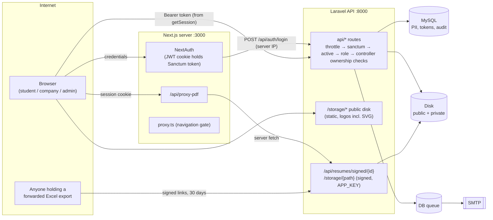

# Attack surface — IIT (ISM) CDC Placement Portal (Part 1 recon)

Working tree on commit `7bcff0a` + uncommitted Phase 2 (M2–M10) and QA Part 10 changes, 2026-10-01.

## 1. Route inventory

Generated by `security/route_inventory.php` (boots Laravel, reads every `api/*` route's middleware chain and statically scans the controller method + one level of `$this->helper()` calls). Full table: [`evidence/routes.md`](evidence/routes.md).

| Tier | Routes | Take object IDs | Mutating | Accept files | Send mail / notifications (static scan) |
|---|---|---|---|---|---|
| Public (`throttle:api` only) | 9 | 1 (signed resume) | 6 | 2 (company register logo; signed route is a false positive) | 4 |
| Any authenticated role (`auth:sanctum`, `active`) | 6 | 1 | 3 | 0 | 0 |
| Admin (`role:admin`) | 102 | 65 | 58 | 5 | 30 |
| Company (`role:company`) | 30 | 15 | 16 | 2 | 5 |
| Student (`role:student`) | 20 | 7 | 9 | 2 | 1 |
| **Total `api/*`** | **167** | | | | |

Every authenticated route carries `auth:sanctum` + `active` + exactly one `role:` (verified by the QA route sweep and again here). Public routes:

| Route | Purpose | Abuse angle |
|---|---|---|
| `POST /api/auth/login` | token for any role (email or roll no) | brute force, enumeration, timing |
| `POST /api/auth/forgot-password` | reset mail | mail abuse, enumeration |
| `POST /api/auth/reset-password` | set password from reset **or** 7-day invite token | token guessing/reuse |
| `POST /api/auth/company/register` | company + user + logo upload | SVG upload, mass registration |
| `POST /api/auth/company/recruiter-email/verification-link` | mails a link to any address | mail bombing, enumeration (A7) |
| `GET /api/auth/company/recruiter-email/verify` | renders Blade HTML, links back to frontend | reflected content, redirect |
| `GET /api/auth/company/recruiter-email/verification-status` | verification state of any email | enumeration (A7) |
| `POST /api/alumni-outreach` | public form, mails | spam, stored XSS in admin view |
| `GET /api/resumes/signed/{resume}` | signed resume PDF (30 days in exports, 30 min previews) | bearer link, ID swap |

Non-API Laravel routes: `GET /` (welcome view), `GET /up` (health), `GET /sanctum/csrf-cookie` (unused by the app), **`GET` and `PUT /storage/{path}`** (`storage.local` and `storage.local.upload`, registered because `config/filesystems.php` sets `'serve' => true` on the **private** `local` disk; both are signature-gated, and the signature depends only on `APP_KEY`). The public disk is served as static files through `public/storage` (symlink).

## 2. Next.js server surface

| Surface | File | Notes |
|---|---|---|
| NextAuth handler | `app/api/auth/[...nextauth]/route.ts` → `auth.ts` | Credentials provider calls Laravel `POST /api/auth/login` **from the Next server** (so every login reaches Laravel from one IP). JWT strategy, no `maxAge` (default 30 days); `session.accessToken` = the Sanctum token; `trustHost: true`. |
| PDF proxy | `app/api/proxy-pdf/route.ts` | Session-gated (any role); allow-list: API origin + `/storage/policy-documents/*` or `/api/resumes/signed/*`, or app origin `*.pdf`; `redirect: "error"`; upstream must be `application/pdf`; response forced to `application/pdf` + `nosniff` + `no-store`. |
| Middleware | `proxy.ts` | matcher `/auth/*`, `/admin/*`, `/company/*`, `/student/*`; role → redirect only (navigation gate, not a data boundary). |
| Server actions | none (`grep "use server"` → 0) | |
| Headers | `next.config.ts` | X-Frame-Options SAMEORIGIN, nosniff, Referrer-Policy, Permissions-Policy, HSTS; **no CSP**; `poweredByHeader: false`; `allowedDevOrigins` includes LAN IP `172.22.78.215`. |

Every page is a client component; data flows browser → Laravel directly with `Authorization: Bearer <session.accessToken>`.

## 3. Data inventory (PII and sensitive business data)

Column lists: [`evidence/db_columns.txt`](evidence/db_columns.txt) (local MySQL, row counts included: 2,892 student profiles, 6,183 applications, 2,893 resumes).

| Table | Sensitive columns | Readable through the API by |
|---|---|---|
| `student_profiles` | roll_no, full_name, institute_email, **personal_email, phone**, programme, branch, batch, **current_cgpa, ongoing/total backlogs, gender, date_of_birth, tenth/twelfth %, category, pwd, home_state**, photo_path, linkedin/github | the student (own); admin (all: list, detail, exports); company (applicants of its own postings: roll, name, programme, branch, batch, CGPA, backlogs, 10th/12th, answers; phone/personal email only with `share_contact_details`) |
| `resumes` + private files `resumes/{roll}/…pdf` | file, label, status, admin remark | student (own, blob); admin (queue, preview via signed URL); company (signed link per applicant); **anyone holding a signed link** (30 days) |
| student photos `student-photos/{roll}/…` (private disk) | photo | student (own), admin |
| `applications` | status, answers, unverified-resume flag, placed-elsewhere flag | student (own, no flags); admin (all); company (own postings, no flags) |
| `application_round_results` | per-round result, attendance, drafts | admin; company (published only); student (published, own) |
| `offers` | type, **CTC, stipend** | student (own); admin (all, analytics); company (own postings) |
| `placement_blocks` | scope, reason, **debarment remark** | student (own sentences); admin |
| `branch_change_requests` | reason, remark | student (own); admin |
| `users` | email, **password (bcrypt), remember_token**, role, is_super_admin, is_active | must never be serialised beyond name/email/role |
| `companies` | **hr/head/PoC names, emails, phones**, postal address, turnover | company (own); admin (all) |
| `jnfs` / `infs` | form_data (salary, eligibility, contacts) | company (own); admin; students (whitelisted posting view via `PostingPresenter`) |
| `alumni_outreach_submissions` | alumni name, email, phone, employer, message | admin |
| `personal_access_tokens` | sha256 token hashes | none (server only) |
| `password_reset_tokens`, `student_invite_tokens`, `recruiter_email_verifications` | hashed tokens | none |
| `audit_logs` | actor email, IP, before/after JSON (may contain PII) | admin |
| `email_logs` | recipient email, subject, error message | admin? (Phase 1 has no UI; verify) |
| `notifications` | per-user messages | owner user |

## 4. File entry points

| Upload | Endpoint | Rule (server) | Disk / path | Served back |
|---|---|---|---|---|
| Company logo | `POST /api/auth/company/register` (public), `POST /api/company/profile/logo` | `mimes:jpg,jpeg,png,webp,svg`, max 2 MB | **public** `company-logos/{hash}.{ext}` | static `/storage/company-logos/…` on the API origin (**SVG allowed**) |
| Company form attachment | `POST /api/company/uploads` (dead route, still live) | `mimes:pdf,doc,docx,png,jpg,jpeg`, 5 MB | **public** `company-forms/{companyId}/{hash}` | static `/storage/company-forms/…` (guessable only by hash) |
| Policy document | `POST/PUT /api/admin/policy-documents` | `mimes:pdf`, 5 MB | **public** `policy-documents/{hash}.pdf` | static + PDF proxy |
| Resume | `POST /api/student/resumes` | `mimes:pdf` + `mimetypes:application/pdf`, `Resume::MAX_KB` | **private** `resumes/{roll}/{slot}_{uuid}.pdf` | student blob endpoint; signed route `/api/resumes/signed/{id}`; admin preview through proxy |
| Student photo | `POST /api/student/profile/photo` | `mimes:jpg,jpeg,png`, 1 MB | **private** `student-photos/{roll}/{uuid}.{client ext}` | student/admin endpoints |
| Spreadsheet imports | `POST /api/admin/students/import`, `/admin/students/academics`, `/admin/placement-cycles/{c}/enroll`, `/admin/postings/{p}/rounds/{r}/results` (file) | `mimes:csv,txt,xlsx,xls`, 5 MB; reader chosen from the **client** filename | not stored (temp) | n/a (PhpSpreadsheet parse) |

## 5. Outbound connections

- **Mail** (SMTP per `.env`; log mailer in this audit): `MailDispatchService` (Phase 2, queued or sync), `PortalNotificationService::sendLoggedEmail` (Phase 1, sync), `Password::sendResetLink`, `CompanyAuthController` (verification links), `AlumniOutreachController`.
- **Queue**: database queue (`jobs` table); `SendQueuedMailable` payloads are PHP-serialised (Laravel standard).
- **HTTP fetches**: backend none (`Http::`, `curl_`, `file_get_contents(`, Guzzle → 0 hits in `app/`). Next server: `auth.ts` → Laravel login; `/api/proxy-pdf` → API origin only.
- **Browser-side third party**: `components/forms/shared/pdfviewer.tsx` loads the pdf.js worker from `unpkg.com` at runtime (no SRI).
- **File writes**: `storage/app/public/{company-logos,company-forms,policy-documents}`, `storage/app/private/{resumes,student-photos}`, `storage/logs/laravel.log`; exports stream to `php://output`.

## 6. Trust boundaries

Boundaries that matter: (1) browser ↔ Laravel, bearer token readable by page JavaScript (`getSession()`), so any XSS on :3000 = API token theft; (2) public storage on the API origin serves attacker-uploaded files (SVG); (3) signed URLs are bearer credentials whose integrity rests on `APP_KEY`; (4) the Next server is the single client IP for every login.

## 7. Threat model (STRIDE per actor)

| Actor | Spoofing | Tampering | Repudiation | Information disclosure | DoS | Elevation |
|---|---|---|---|---|---|---|
| Guest | brute-force / default creds on admin; reset-token guessing | public forms (alumni, register) storing script | — | enumeration via verification-status, timing | mail bombing via public mail endpoints; login lockout of others (shared IP) | — |
| Student | — | own profile fields beyond allowed; application flags; resume status | — | other students' resumes/photos/applications/offers via IDs; applicant counts | apply/withdraw loops sending mail | self-unblock, self-enrol, approve own branch change |
| Company | another company's postings | inject results via proposals; edit floated forms | — | competitor applicants; contact data without `share_contact_details`; unpublished results | export spam | publish results / float |
| Admin (normal) | — | — | actions without audit rows | bulk exports | — | super-admin functions, promote self |
| Malicious insider admin | — | results, blocks | delete/alter audit log | mass PII export | — | — |
| Super admin | — | — | — | — | — | — |
| Holder of a leaked export | — | — | — | resumes via 30-day signed links | — | — |

### Top 10 abuse cases prioritised

1. **Admin takeover with default/committed credentials** (seeded super-admin password in git history; weak).
2. Stored XSS in rich text / names / URLs rendered to admins → steal `session.accessToken` (7-day token) → full admin API.
3. Student reads another student's resume/photo/application/offers (BOLA on `/student/*`, signed routes, `/storage/{path}`).
4. Company reads a competitor's applicants, exports, proposals or unpublished results (BOLA on `/company/*`).
5. Forging signed URLs (APP_KEY exposure) → every resume and private file.
6. Privilege escalation via mass assignment (`role`, `is_super_admin`, `is_active`, `status`, flags) on any update endpoint.
7. A student or company invoking admin functions (publish, unblock, float, enrol, approve) — function-level authorisation.
8. Malicious uploads: SVG logo with script on the API origin; spreadsheet XXE/zip-bomb; path traversal.
9. Credential stuffing / login lockout of everyone through the Next server's single IP; unauthenticated mail endpoints abused for spam.
10. Over-fetching PII in JSON (contact fields, hidden user fields) and leaking applicant counts to students.
