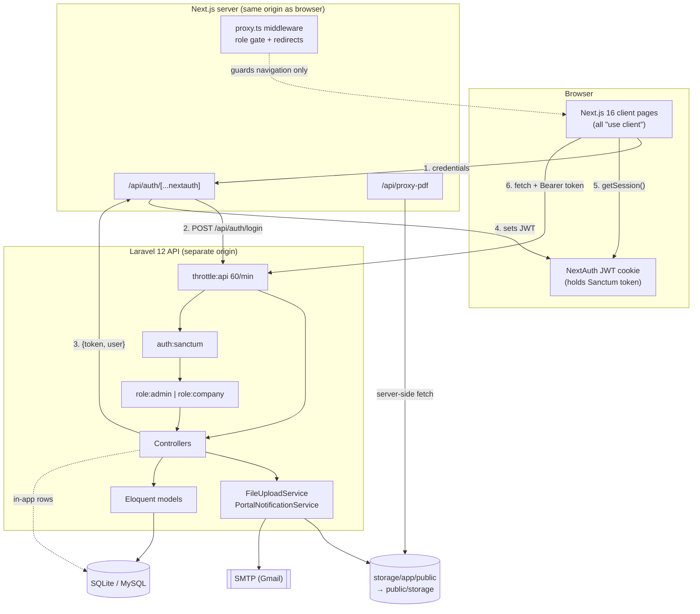
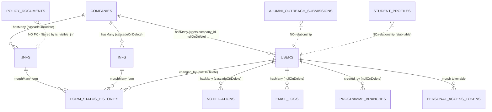

# PROJECT_CONTEXT.md

Audit of the existing codebase at `/Users/admin/Desktop/CDC-main`, written so an engineer who has never seen this repo can build Phase 2 (the Student side) consistently with Phase 1.

**Every claim below was verified by reading the referenced file.** Anything I could not verify from code is in §14 "Open Questions / Unverified". Anything referenced-but-not-implemented is called out explicitly.

Audit date: 2026-09-27. Git: branch `main`, HEAD `df7034b`.

---

## 1. Overview

### What the app does today

The repo contains a **recruiter-and-admin placement portal** for the Career Development Centre (CDC) of IIT (ISM) Dhanbad, plus two unrelated extras (a static event microsite and a stray local-LLM model manifest).

The working application (`CDC/`) lets:

1. **A recruiter (company HR)** self-register — which requires verifying their work email by clicking a link before the registration form can be completed (`CDC/backend/app/Http/Controllers/CompanyAuthController.php:73-77`).
2. That recruiter to maintain a **company profile** (`CompanyProfileController`), including a logo upload.
3. That recruiter to fill, autosave, submit, duplicate and delete **JNFs** (Job Notification Forms) and **INFs** (Internship Notification Forms). Both are 7-tab wizards whose full contents are stored as a single JSON blob in `jnfs.form_data` / `infs.form_data`.
4. **CDC admins** to review each form: mark drafts for review, add internal notes, grant edit access back to the company, edit the company's submitted form data field-by-field, accept, reject, and download an accepted form as a one-row CSV.
5. Admins to manage companies (read-only in the UI), the eligibility branch catalogue, policy/guideline documents shown inside the forms, other admin accounts (super-admin only), and to read in-app notifications.
6. **Anyone (unauthenticated)** to submit an **alumni outreach form** at `/alumni`, which admins read at `/admin/alumni-outreach`.

There is **no student-facing functionality at all** today. See §13.

### Roles, exactly as implemented

`users.role` is a MySQL/SQLite `enum` with exactly two values:

```php
// CDC/backend/database/migrations/2026_03_30_000011_add_role_to_users_table.php:15
$table->enum('role', ['admin', 'company'])->default('company');
```

| Role | How created | Scope |
|---|---|---|
| `company` | `POST /api/auth/company/register` (public, after email verification); also `CompanySeeder` | One `users` row per recruiter, linked to one `companies` row via `users.company_id`. All company APIs scope by `$request->user()->company`. |
| `admin` | `AdminUserSeeder` (from `ADMIN_EMAIL`/`ADMIN_PASSWORD`); `POST /api/admin/manage-admins` (super-admin only); **and `POST /api/auth/admin/register`, which is public — see §12**. | Sees everything. No per-admin scoping. |

A second, non-enum privilege flag exists: `users.is_super_admin` (boolean, default `false`, added by `2026_05_01_000000_add_is_super_admin_to_users_table.php`). It is **not** a role; it is checked inline in `AdminManagementController` (`:16`, `:29`, `:60`) and gates only the "Manage Admins" screen and nav item.

Two further "actors" exist but are **not users**:

- **Alumni** — submit a public form; rows land in `alumni_outreach_submissions`; no account, no login, no model relationship to `users`.
- **Students** — referenced in copy ("This will be displayed to students", `jnfformpro.tsx:828`) and in eligibility data, but have **no** role, table with columns, controller logic, route, or UI. Only empty stubs exist (§13).

---

## 2. Tech Stack (exact)

Versions below are the **installed** versions from `composer.lock` and `package-lock.json`, not the semver ranges in the manifests. Where the two differ, the range is shown in parentheses.

### Backend — `CDC/backend`

| Concern | Choice | Exact version |
|---|---|---|
| Language | PHP | `^8.2` required (`composer.json`); `platform` constraint `php: ^8.2` |
| Framework | `laravel/framework` | **v12.56.0** (`^12.0`) |
| API auth | `laravel/sanctum` | **v4.3.1** (`^4.3`) — bearer personal access tokens |
| REPL | `laravel/tinker` | v2.11.1 |
| PDF parsing | `smalot/pdfparser` | v2.12.4 — **declared but never imported anywhere in `app/`, `routes/` or `config/`. Dead dependency** (§12) |
| ORM | Eloquent (bundled with Laravel) | — |
| HTTP client | `guzzlehttp/guzzle` | 7.10.0 (transitive) |
| Dates | `nesbot/carbon` | 3.11.3 |
| Logging | `monolog/monolog` | 3.10.0 |
| Mail transport | `symfony/mailer` | v7.4.6 |
| CORS | `fruitcake/php-cors` | v1.4.0 |

Dev/tooling: `phpunit/phpunit` **11.5.55** (`^11.5.50`), `mockery/mockery` 1.6.12, `fakerphp/faker` v1.24.1, `laravel/pint` v1.29.0 (formatter — **no config file, never run in any script**), `laravel/pail` v1.2.6 (log tailing), `laravel/sail` v1.55.0 (**no `compose.yaml` in the repo**), `nunomaduro/collision` v8.9.1.

Backend also has a **second, separate Node toolchain** for Blade assets — `CDC/backend/package.json`: `vite ^7.0.7`, `laravel-vite-plugin ^2.0.0`, `@tailwindcss/vite ^4.0.0`, `tailwindcss ^4.0.0`, `axios ^1.11.0`, `concurrently ^9.0.1`. It builds `resources/css/app.css` + `resources/js/app.js`, which are used by **exactly one page**: the stock Laravel `welcome.blade.php`. Not used by the SPA.

### Frontend — `CDC/frontend`

| Concern | Choice | Exact version |
|---|---|---|
| Framework | `next` | **16.2.1** (App Router, Turbopack root pinned in `next.config.ts:30-32`) |
| UI runtime | `react` / `react-dom` | **19.2.4** |
| Language | `typescript` | 5.9.3 (`strict: true`, `tsconfig.json:7`) |
| Auth | `next-auth` | **5.0.0-beta.30** (+ `@auth/core` 0.41.0) — JWT session strategy, Credentials provider only |
| Component library | `@mui/material` + `@mui/icons-material` | **6.5.0** |
| Data grid | `@mui/x-data-grid` | 8.28.1 — **installed but never imported** (§12) |
| CSS-in-JS | `@emotion/react` 11.14.0, `@emotion/styled` 11.14.1, `@emotion/cache` 11.14.0 | SSR cache wired in `app/themeregistry.tsx` |
| Utility CSS | `tailwindcss` + `@tailwindcss/postcss` | **4.2.2** — only `@import "tailwindcss"` in `app/globals.css`; **no Tailwind class is used in any component.** Effectively unused |
| Forms | `react-hook-form` 7.72.0 + `yup` 1.7.1 + `@hookform/resolvers` 5.2.2 | Used **only** on auth + registration pages; the JNF/INF wizards use raw `useState` (§9) |
| Phone input | `libphonenumber-js` 1.12.42 | |
| Rich text | `react-quill-new` 3.8.3 (`quill` 2.0.3) | dynamic-imported, `ssr: false` |
| PDF viewer | `react-pdf` 10.4.1 (`pdfjs-dist` 5.4.296) | worker loaded from `//unpkg.com` CDN at runtime (`pdfviewer.tsx:12`) |
| Drag & drop | `@hello-pangea/dnd` 18.0.1 | selection-round reordering |
| Dates | `date-fns` 4.1.0 | **installed but never imported** (§12) |
| HTTP | `axios` 1.14.0 | **installed but never imported**; all calls use `fetch` (§12) |
| E2E / perf | `@playwright/test` 1.58.2 | |
| Lint | `eslint` 9.39.4 + `eslint-config-next` 16.2.1 | flat config in `eslint.config.mjs` |

**`CDC/frontend/AGENTS.md` + `CLAUDE.md` carry a standing instruction** that this Next.js version has breaking changes vs. older knowledge and that `node_modules/next/dist/docs/` must be read before writing code. Phase 2 should honour that. Two concrete consequences already visible in the code: **dynamic route `params` is a `Promise`** (`use(params)` — `app/company/jnf/[id]/edit/page.tsx:23-24`), and **middleware lives in `proxy.ts`, not `middleware.ts`**.

### Database

- **Config default is SQLite**: `'default' => env('DB_CONNECTION', 'sqlite')` (`config/database.php`). Connections defined: sqlite, mysql, mariadb, pgsql, sqlsrv (all stock Laravel).
- **No `database/database.sqlite` exists in this checkout** (`CDC/backend/database/` contains only `.gitignore`, `factories/`, `migrations/`, `seeders/`). So the DB has not been created here.
- `.env` is present but untracked; I did not read its values (see §6 note). Docs disagree on the target: `CDC/docs/DEVELOPER_GUIDE.md` says "SQLite for local dev, MySQL-ready"; `CDC/project_dependencies.md` and `CDC/SETUP_GUIDE.md` prescribe MySQL `iitism_placement`.
- Tests always run on **in-memory SQLite** (`phpunit.xml:26-27`).
- A committed error log (`log_filtered.txt`, UTF-16LE) shows the app has been run against SQLite at `C:\DBMS\CDC\backend\database\database.sqlite` — i.e. on Windows, by another developer.

### Auth method

Two layers, chained:

1. **Backend** issues Laravel Sanctum **personal access tokens** (`User` uses `HasApiTokens`). `POST /api/auth/login` returns `{message, token, user}` (`AuthController:58-64`). All protected routes use `auth:sanctum` + the custom `role` middleware. Sanctum `'expiration' => null` — **tokens never expire** (`config/sanctum.php:50`).
2. **Frontend** wraps that in **NextAuth v5 JWT sessions**. `auth.ts` Credentials provider calls the Laravel login endpoint and stuffs the Sanctum token into the JWT (`auth.ts:68`), then re-exposes it on the session as `session.accessToken` (`auth.ts:92`). `lib/adminapi.ts` / `lib/companyapi.ts` read it via `getSession()` and send `Authorization: Bearer <token>`.

Sanctum's cookie/SPA mode is configured but unused — no frontend code calls `/sanctum/csrf-cookie`.

### Styling / theming

MUI theme in `CDC/frontend/lib/theme.ts`: light mode, `primary.main #7B1113` (IIT ISM maroon), `secondary.main #1a237e` (navy), `shape.borderRadius: 8`, Inter/Roboto font stack, component overrides for Button/Card/TextField/AppBar. Notably `typography.allVariants.textAlign: 'justify'` (`theme.ts:48-50`) and `body { text-align: justify }` in `app/globals.css` — an unusual global that Phase 2 will inherit.

### State management

**None.** No Redux/Zustand/Jotai/React Query/SWR. Every page is a `"use client"` component that fetches in `useEffect` into local `useState`. Cross-component signalling uses one hand-rolled `window` event: `"admin-notifications-updated"` (dispatched in `app/admin/notifications/page.tsx:52-58`, listened for in `components/admin/adminshell.tsx:71-87`).

### File upload / storage

`config/filesystems.php` — default disk `local` (`storage/app/private`), plus a `public` disk at `storage/app/public` served at `APP_URL/storage`, plus stock `s3`. Uploads always target the **public** disk:

| What | Path | Code |
|---|---|---|
| Company logo | `company-logos/` | `CompanyAuthController:81`, `CompanyProfileController:137` |
| Policy PDFs | `policy-documents/` | `FileUploadService::uploadPolicyFile` |
| Generic form file | `company-forms/{companyId}/` | `FileUploadService::uploadFormFile` |

**`CDC/backend/public/storage` does not exist in this checkout** — `php artisan storage:link` has not been run, so uploaded logos are currently not servable. One committed artefact exists: `storage/app/public/company-logos/n91VYQTaPv7xRej0LKIRC9rQ4tDGiUJ2GCi5iOmO.jpg`.

### Email / notifications

- **Email**: Laravel Mail over `symfony/mailer`. `config/mail.php` default mailer is `env('MAIL_MAILER', 'log')`, host defaults to `smtp.gmail.com:587`. Nine Mailables in `app/Mail/`, each with a Blade view in `resources/views/emails/`. All are sent **synchronously** — every Mailable `use Queueable` but every call site uses `Mail::to(...)->send(...)`, never `queue()`. So SMTP latency is on the request path.
- **In-app**: own table `notifications` via model `App\Models\PortalNotification` (`protected $table = 'notifications'`). Types: `info|success|warning|error`. **This is not Laravel's `DatabaseNotification`** — see §11.
- **Email audit**: every send attempt writes an `email_logs` row with `status` `sent|failed` and `error_message`. Centralised in `PortalNotificationService::sendLoggedEmail`, but several controllers duplicate that try/catch inline instead (§12).

### Deployment / hosting config

There is **no deployment config in the repo**: no Dockerfile, no `compose.yaml`, no CI workflow (`.github/` absent), no nginx/Apache vhost, no PM2/systemd unit, no `vercel.json`. Only:

- `CDC/backend/public/.htaccess` — stock Laravel Apache rewrite rules.
- Security headers for the frontend in `next.config.ts:4-25`: `X-Frame-Options: SAMEORIGIN`, `X-Content-Type-Options: nosniff`, `Referrer-Policy: strict-origin-when-cross-origin`, `Permissions-Policy: camera=(), microphone=(), geolocation=()`, `Strict-Transport-Security: max-age=31536000; includeSubDomains`. `poweredByHeader: false`.
- A manual release checklist in `CDC/docs/PRODUCTION_CHECKLIST.md`.

### Dev tooling summary

| Tool | Configured? | Wired into a script? |
|---|---|---|
| ESLint (frontend) | yes, `eslint.config.mjs` | `npm run lint` |
| Prettier | **no config anywhere** | no |
| Laravel Pint | installed, **no `pint.json`** | no |
| PHPUnit | `phpunit.xml` | `php artisan test`, `npm run backend:test` |
| Playwright | `playwright.config.ts` (chromium/firefox/webkit, auto-starts `npm run dev`) | `test:e2e`, `test:e2e:smoke`, `test:perf` |
| EditorConfig | `CDC/backend/.editorconfig` (backend only — 4-space; frontend code is 2-space) | n/a |
| TypeScript | `strict: true`, `noEmit: true`, `@/*` → `./*` | via `next build` |

---

## 3. How to Run

### Repo shape (important, and a trap)

The git root is `/Users/admin/Desktop/CDC-main`, but **the application lives one level down in `CDC/`**. The root also holds a *duplicated, partly stale* copy of the docs, plus `package.json` / `package-lock.json` whose scripts assume `frontend/` and `backend/` are siblings **of that file** — they are not, so **`npm run frontend:dev` from the git root fails.** The identical `CDC/package.json` is the one that works.

```
/Users/admin/Desktop/CDC-main/      ← git root: duplicated docs + broken monorepo scripts
└── CDC/                            ← the actual project; run commands from here
    ├── backend/                    ← Laravel 12 API
    └── frontend/                   ← Next.js 16 app
```

### Dev — backend

From `CDC/backend`. This is the **root `README.md`** sequence, which is the more complete of the two copies (the `CDC/README.md` copy omits steps 3 and 5):

```bash
composer install
cp .env.example .env
php artisan key:generate
# Step 3 (root README only): ensure PHP_CLI_SERVER_WORKERS=4 is set in .env.
#   Rationale given in the README: the built-in PHP server otherwise deadlocks
#   when Next.js fires concurrent background API requests.
php artisan migrate
php artisan db:seed
php artisan storage:link      # Step 5 (root README only): REQUIRED for company logos to load
php artisan serve             # http://127.0.0.1:8000
```

Neither `storage:link` nor `PHP_CLI_SERVER_WORKERS` appears in `CDC/README.md`, `CDC/SETUP_GUIDE.md`, `CDC/docs/DEVELOPER_GUIDE.md` or `CDC/project_dependencies.md`. **In this checkout neither has been done** (`public/storage` is absent).

`composer.json` also defines two convenience scripts:
- `composer setup` → install, copy `.env`, key:generate, `migrate --force`, `npm install`, `npm run build` (the backend's *Blade* asset build, not the frontend).
- `composer dev` → `concurrently` running `php artisan serve` + `queue:listen` + `pail` + `npm run dev`.

Note `composer dev` starts a queue worker, but **nothing in the codebase dispatches a job**, so the worker is idle.

### Dev — frontend

From `CDC/frontend`:

```bash
npm install
# .env.local must exist. NOTE: there is NO .env.example in CDC/frontend,
# even though README.md and DEVELOPER_GUIDE.md both say `cp .env.example .env.local`.
# Create it by hand with the three names in the table below.
npm run dev                   # http://localhost:3000
```

Scripts: `dev`, `build`, `start`, `lint`, `test:e2e`, `test:e2e:smoke`, `test:perf`.

### Helper scripts (run from `CDC/`, not the git root)

```bash
npm run frontend:dev  |  frontend:lint  |  frontend:build
npm run frontend:test:e2e            # smoke spec only
npm run frontend:test:perf           # chromium only
npm run backend:test  |  backend:serve
```

### Prod

There is no automated deploy. `CDC/docs/PRODUCTION_CHECKLIST.md` + `DEVELOPER_GUIDE.md` prescribe, by hand: provision MySQL/MariaDB + PHP 8.2 + Node 20; `APP_ENV=production`, `APP_DEBUG=false`; `php artisan migrate --force`, `config:cache`, `route:cache`, `view:cache`; `npm run build` then `npm run start`; TLS/HSTS at the proxy; verify indexes; run `backend:test` + `frontend:lint` + `frontend:build` as the gate.

### Environment variables

**Names only** — values are not reproduced here.

#### Backend `CDC/backend/.env` (template: `.env.example`, which *is* tracked)

Project-specific / behaviour-affecting:

| Name | What the code does with it |
|---|---|
| `APP_KEY` | Laravel encryption key. |
| `APP_URL` | Base URL; also builds the `public` disk's public URL (`filesystems.php:44`) and the SMTP EHLO domain (`mail.php`). |
| `APP_ENV`, `APP_DEBUG`, `APP_NAME` | Standard. `APP_NAME` also seeds the session-cookie and cache-prefix names. |
| **`FRONTEND_URL`** | Exposed as `config('app.frontend_url')` (`config/app.php:7`). Used to build **every** link emailed to a user: password reset (`AppServiceProvider:26-31`, `User::sendPasswordResetNotification`), admin review deep links (`CompanyJnfController:457`), the company's own form link (`:499`), and the post-verification redirect back to `/company/register` (`CompanyAuthController:331-341`). Default `http://127.0.0.1:3000`. **If this is wrong, every emailed link is wrong.** |
| **`FRONTEND_URLS`** | Comma-separated extra CORS origins (`config/cors.php:3-13`). `FRONTEND_URL`, `http://127.0.0.1:3000` and `http://localhost:3000` are always allowed. |
| `MAIL_MAILER`, `MAIL_SCHEME`, `MAIL_HOST`, `MAIL_PORT`, `MAIL_USERNAME`, `MAIL_PASSWORD`, `MAIL_FROM_ADDRESS`, `MAIL_FROM_NAME` | SMTP. Docs prescribe Gmail + a 16-char App Password. |
| `DB_CONNECTION`, `DB_HOST`, `DB_PORT`, `DB_DATABASE`, `DB_USERNAME`, `DB_PASSWORD` | Connection. |
| **`ADMIN_EMAIL`, `ADMIN_NAME`, `ADMIN_PASSWORD`** | Read **directly via `env()`** inside `AdminUserSeeder:16-19` to `updateOrCreate` the bootstrap super-admin. Because they bypass `config()`, `php artisan config:cache` in production will make them return `null` and the seeder will misbehave. |
| `SESSION_DRIVER`, `SESSION_LIFETIME`, `SESSION_ENCRYPT`, `SESSION_PATH`, `SESSION_DOMAIN` | Session (used by the stock web route only). |
| `CACHE_STORE`, `QUEUE_CONNECTION`, `BROADCAST_CONNECTION`, `FILESYSTEM_DISK`, `BCRYPT_ROUNDS` | Standard. |
| `LOG_CHANNEL`, `LOG_STACK`, `LOG_LEVEL`, `LOG_DEPRECATIONS_CHANNEL` | Standard. |
| `REDIS_*`, `MEMCACHED_HOST`, `AWS_*` | Present in the template; no code path uses them today. |
| `APP_LOCALE`, `APP_FALLBACK_LOCALE`, `APP_FAKER_LOCALE`, `APP_MAINTENANCE_DRIVER`, `VITE_APP_NAME` | Standard. |

**Referenced in code but absent from `.env.example`** — Phase 2 should add them:

| Name | Used at | Effect if unset |
|---|---|---|
| `COMPANY_RECRUITER_VERIFY_TTL_MINUTES` | `CompanyAuthController:192` | Falls back to 30 (floor 5). This TTL also silently governs how long a *completed* verification stays valid — see §12. |
| `SANCTUM_STATEFUL_DOMAINS`, `SANCTUM_TOKEN_PREFIX` | `config/sanctum.php:18,65` | Defaults used. |
| `PHP_CLI_SERVER_WORKERS` | not read by app code; read by the PHP CLI server | Commented out in the template, but the root `README.md` calls setting it "Critical Configuration". |

> `.env.example` has a **stray line 15 containing just `a`** (a broken `# APP_MAINTENANCE_STORE=` edit). Harmless to `vlucas/phpdotenv`, but it is corruption in a tracked file.

#### Frontend `CDC/frontend/.env.local` (untracked; **no `.env.example` exists**)

| Name | What the code does with it |
|---|---|
| `NEXT_PUBLIC_API_URL` | Base for every API call. Read in `lib/adminapi.ts:3`, `lib/companyapi.ts:3` (default `http://localhost:8000/api`), `auth.ts:4` (**strips a trailing `/api`**, then re-appends `/api/auth/login`), and directly in `app/alumni/page.tsx:23`, `app/company/register/page.tsx:414,539,701`, `app/auth/*`. Note the auth pages default to `http://127.0.0.1:8000/api` while the api libs default to `http://localhost:8000/api` — inconsistent, and the two hostnames are distinct CORS origins. |
| `NEXTAUTH_URL` | NextAuth callback base. |
| `NEXTAUTH_SECRET` | JWT signing secret. |

---
## 4. Folder & File Map

### Full tree (excluding `node_modules`, `vendor`, `.git`, `.next`, build output, lock files, binary assets)

```
CDC-main/
├── .gitignore
├── package.json, package-lock.json      # monorepo scripts — BROKEN at this level (§3)
├── README.md, SETUP_GUIDE.md, PROJECT_STATUS.md, RESUME_PROMPT.md
├── explanation.md, log_filtered.txt
├── docs/{API,DEVELOPER_GUIDE,IMPLEMENTATION,PRODUCTION_CHECKLIST,USER_GUIDE}.md
├── *.pdf, *.docx                        # AIPC guidelines, CDC policy (x2 copies), conclave proposal
├── conclave/                            # standalone static microsite (unrelated to the portal)
│   ├── index.html, script.js, styles.css
│   └── images/
├── CDC/                                 # ◀ THE APPLICATION
│   ├── package.json, package-lock.json  # working monorepo scripts
│   ├── README.md, SETUP_GUIDE.md, PROJECT_STATUS.md, RESUME_PROMPT.md, project_dependencies.md
│   ├── docs/  (same five files as root, mostly byte-identical modulo CRLF)
│   ├── ml/models/manifests/registry.ollama.ai/library/qwen2.5/{7b,latest}   # orphaned (§12)
│   ├── backend/
│   │   ├── .editorconfig .env .env.example .gitattributes .gitignore README.md
│   │   ├── artisan  composer.json  composer.lock  package.json  phpunit.xml  vite.config.js
│   │   ├── app/
│   │   │   ├── Http/Controllers/  (16 files)
│   │   │   ├── Http/Middleware/   (2 files)
│   │   │   ├── Http/Requests/     (2 files)
│   │   │   ├── Mail/              (9 files)
│   │   │   ├── Models/            (12 files)
│   │   │   ├── Providers/AppServiceProvider.php
│   │   │   └── Services/          (2 files)
│   │   ├── bootstrap/{app.php,providers.php,cache/*}
│   │   ├── config/  (12 files)
│   │   ├── database/{factories,migrations (27),seeders (5)}
│   │   ├── public/{index.php,.htaccess,robots.txt,favicon.ico}
│   │   ├── resources/{css/app.css,js/*,views/*}
│   │   ├── routes/{api.php,web.php,console.php}
│   │   ├── storage/
│   │   └── tests/{Feature (7),Unit (1),TestCase.php}
│   └── frontend/
│       ├── AGENTS.md CLAUDE.md README.md .env.local .gitignore
│       ├── auth.ts  proxy.ts  next.config.ts  tsconfig.json  eslint.config.mjs
│       ├── postcss.config.mjs  playwright.config.ts  next-env.d.ts
│       ├── test-{format,intl,length,length-max,parse-country,phone}.js   # scratch, dead (§12)
│       ├── app/
│       │   ├── layout.tsx  page.tsx  error.tsx  globals.css  themeregistry.tsx  icon.png  favicon.ico
│       │   ├── admin/     (13 files across 9 routes)
│       │   ├── alumni/page.tsx
│       │   ├── api/auth/[...nextauth]/route.ts,  api/proxy-pdf/route.ts
│       │   ├── auth/      (4 routes)
│       │   └── company/   (11 files across 9 routes)
│       ├── components/{admin,auth,company,forms}/...
│       ├── lib/{adminapi.ts,companyapi.ts,theme.ts,polyfill.ts}
│       ├── public/{images/*,*.svg,*.pdf}
│       ├── tests/{e2e/smoke.spec.ts,performance/navigation.perf.spec.ts}
│       ├── test-results/.last-run.json          # committed, status "failed" (§12)
│       └── types/next-auth.d.ts
```

### Backend — entry points & config

| File | What it does / exports | Depended on by |
|---|---|---|
| `artisan` | Stock CLI entry. | developer |
| `public/index.php` | Stock HTTP front controller. | web server |
| `public/.htaccess` | Stock Apache rewrites; forwards `Authorization` and `X-XSRF-Token`. | Apache |
| `public/robots.txt` | `User-agent: * / Disallow:` — i.e. allows everything. | crawlers |
| `bootstrap/app.php` | **The only middleware/exception wiring.** Registers routes (`api.php`, `web.php`, `console.php`, health at `/up`); aliases `'role' => RoleMiddleware` (`:18`); makes guest redirects return `null` for `api/*` (`:21-27`); renders `AuthenticationException` as JSON 401 for `api/*` (`:30-38`). No global middleware added. | framework |
| `bootstrap/providers.php` | Returns `[AppServiceProvider::class]`. | framework |
| `bootstrap/cache/packages.php`, `services.php` | **Generated** package-discovery caches. Should not be hand-edited. | framework |
| `config/app.php` | Stock **plus** `'frontend_url' => env('FRONTEND_URL', 'http://127.0.0.1:3000')` (`:7`), which everything emailing a link reads. `timezone` is `UTC`. | app-wide |
| `config/cors.php` | **Customised.** Builds `allowed_origins` from `FRONTEND_URL` + `FRONTEND_URLS` + the two localhost:3000 forms. `paths: ['api/*','storage/*','sanctum/csrf-cookie']`, `allowed_methods: ['*']`, `allowed_headers: ['*']`, `supports_credentials: true`, `max_age: 0`. | browser |
| `config/auth.php` | Stock. Single `web` session guard, Eloquent `users` provider, password-reset tokens in `password_reset_tokens`, **expire 60 min, throttle 60 s**. | password reset |
| `config/sanctum.php` | Stock. **`expiration => null` (tokens never expire)**; guard `['web']`. | token auth |
| `config/database.php` | Stock. **Default connection `sqlite`.** | Eloquent |
| `config/filesystems.php` | Stock. `local`→`storage/app/private`, `public`→`storage/app/public` at `APP_URL/storage`, `s3`. `links` maps `public/storage`→`storage/app/public`. | uploads |
| `config/mail.php` | Stock; default mailer `log`, SMTP host default `smtp.gmail.com`. | Mailables |
| `config/queue.php` | Stock; default `database`. **Nothing is queued.** | idle worker |
| `config/cache.php`, `session.php`, `logging.php`, `services.php` | Stock, unmodified. `services.php` holds unused postmark/resend/ses/slack slots. | — |
| `phpunit.xml` | Suites `Unit`, `Feature`; env overrides incl. `DB_CONNECTION=sqlite`, `DB_DATABASE=:memory:`, `MAIL_MAILER=array`, `QUEUE_CONNECTION=sync`, `BCRYPT_ROUNDS=4`. | `php artisan test` |
| `vite.config.js` + `resources/{css/app.css,js/app.js,js/bootstrap.js}` | Blade-only asset pipeline (Tailwind 4 + axios on `window`). Consumed only by `welcome.blade.php`. | that one page |
| `routes/api.php` | **The entire API surface.** Fully enumerated in §7. | frontend |
| `routes/web.php` | 3 lines: `GET /` → `view('welcome')`. | smoke test |
| `routes/console.php` | Stock `inspire` command only. **No scheduled tasks.** | — |

### Backend — `app/`

| File | What it does / exports | Depended on by |
|---|---|---|
| `Http/Controllers/Controller.php` | Empty `abstract class Controller`. All controllers extend it. | all controllers |
| `Http/Controllers/AuthController.php` | `registerAdmin` (public!), `login`, `logout`, `user`, `forgotPassword`, `resetPassword`. Password rule: `min(8)->letters()->mixedCase()->numbers()`. Name rule: `regex:/^[\pL\s'.-]+$/u`. `forgotPassword` deliberately returns the same message for known and unknown emails (anti-enumeration) and maps transport failures to 503. | `routes/api.php`, `auth.ts` |
| `Http/Controllers/CompanyAuthController.php` | `register` (multipart; creates `Company` + `User` in one `DB::transaction`, requires a prior verified email, notifies all admins, then **deletes** the verification row), `sendRecruiterEmailVerificationLink`, `verifyRecruiterEmail` (renders a Blade page that links back to the frontend), `recruiterEmailVerificationStatus`. Private helpers `isRecruiterEmailVerified`, `normalizeEmail` (lower+trim), `renderRecruiterVerificationResult`. | register page |
| `Http/Controllers/CompanyProfileController.php` | `show`, `update` (validates ~30 fields; packs head/poc1/poc2 into three JSON columns), `updateLogo` (replaces + deletes the old file). | `/company/profile` |
| `Http/Controllers/CompanyDashboardController.php` | `index` → `{company:{name,logo_url}, stats:{10 counters}, recent_jnfs, recent_infs}`. Private `applyCompanyVisibleStatusToJnf/Inf` hide the admin-only "draft marked for review" state from companies by rewriting `under_review`→`draft` when no `submitted` history row exists. | company dashboard |
| `Http/Controllers/CompanyJnfController.php` | `index, show, store, update, destroy, autosave, duplicate, requestEditAccess` + private `sendSubmissionEmailAndNotify`, `sendEditAccessRequestEmailAndNotify`, `sendCompanySubmissionConfirmation`, `buildSubmissionSummary`, `buildEligibilitySummary`, `nullableString`, `hydrateLegacyFormDataIfMissing`, `applyCompanyVisibleStatus`. | JNF wizard & dashboard |
| `Http/Controllers/CompanyInfController.php` | Byte-for-byte parallel to the JNF controller with `internship_*`/`stipend`/`internship_duration_weeks` substituted. ~700 duplicated lines (§12). | INF wizard & dashboard |
| `Http/Controllers/CompanyFileUploadController.php` | `store` — validates `file` (`max:5120`, `mimes:pdf,doc,docx,png,jpg,jpeg`), delegates to `FileUploadService`. **No live caller** (§12). | (dead) |
| `Http/Controllers/AdminFormReviewController.php` | **1611 lines, the biggest file in the repo.** `jnfQueue, infQueue, showJnf, showInf, downloadJnfCsv, downloadInfCsv, addJnfNote, addInfNote, updateLatestJnfRemark, updateLatestInfRemark, updateJnfStatus, updateInfStatus, editJnfFormData, editInfFormData`. Private: `transitionFormStatus` (`:802`), `notifyAdminsForCompanyFormAction`, `isDraftReviewMarked` (`:898`), `isDraftItem`, `resolveHistoryAuthorEmail`, `updateLatestRemarkForAdmin`, `canEditLatestUnderReviewRemark`, `latestEditableUnderReviewRemarkIdForAdmin`, `editFormData`, `detectChangedFields` (`:1199`, ~300 lines of field-by-field diffing), `flattenSelectedBranches`, `streamCsvDownload`, `csvValue`, `cleanHtmlField`, `formatIstTime`. | admin review pages |
| `Http/Controllers/AdminDashboardController.php` | `index` → 15 counters + 5 most recent non-draft JNFs/INFs. Subtracts "draft marked for review" rows out of the `under_review` counters and adds them to `*_draft`. | admin dashboard |
| `Http/Controllers/AdminCompanyController.php` | `index` (search `q` over name/industry/hr_name/hr_email + 10 `withCount` aggregates), `show` (users + 8 counts + last 5 forms), `update` (**no frontend caller** — §12). | admin companies |
| `Http/Controllers/AdminManagementController.php` | `index, store, destroy`. Guards on `$request->user()->is_super_admin` inline. `store` creates the admin with `Str::random(16)` then immediately sends a password-reset link as the invitation. `destroy` refuses non-admins, super-admins and self. | manage-admins |
| `Http/Controllers/AdminProgrammeBranchController.php` | `index` (custom branches + built-in branch on/off states), `store`, `updateExistingStatus` (`updateOrCreate` an `is_custom=false` marker row), `destroy` (custom only). Notifies all admins on every mutation. | branch manager |
| `Http/Controllers/EligibilityCatalogueController.php` | `programmeBranches` → `{programme_branches (custom+active), branch_states (built-in overrides)}`. The **only** non-admin, non-company authenticated route. | both form wizards |
| `Http/Controllers/PolicyDocumentController.php` | `index, store, update, destroy` (admin, via `apiResource`) + `getForCompany` (filters by `?form_type=jnf|inf`). PDF uploads via `FileUploadService::uploadPolicyFile`. | policy manager, declaration step |
| `Http/Controllers/NotificationController.php` | `index` (latest 100 + `unread_count`), `markAsRead` (404s on someone else's row), `markAllAsRead`. Shared by both roles. | both notification pages |
| `Http/Controllers/AlumniOutreachController.php` | `store` (**public**; custom LinkedIn rule accepting a URL *or* the literal `NA`; concatenates `country_code + phone_number` into `phone`; notifies all admins; mails the alumnus, swallowing failures), `index` (admin search). | `/alumni`, admin page |
| `Http/Controllers/StudentProfileController.php` | **Empty class body (`//`). Untracked. Not routed.** (§13) | nothing |
| `Http/Middleware/RoleMiddleware.php` | Aliased `role`. 401 if no user; 403 `{"message":"Forbidden."}` if `$user->role` is not in the variadic allow-list. Variadic, so `role:admin,student` already works. | every protected route |
| `Http/Middleware/EnsureProfileComplete.php` | **No-op stub — `return $next($request)`. Untracked. Not registered in `bootstrap/app.php`.** (§13) | nothing |
| `Http/Requests/StoreJnfRequest.php` | `authorize(): true`. Rules for `job_title, job_description (max:5000), job_location, ctc_min, ctc_max (gte:ctc_min), vacancies, application_deadline, form_data (json), status (in:draft,submitted,under_review,accepted,rejected), admin_remarks`. Used by `store` **and** `update`. | `CompanyJnfController` |
| `Http/Requests/StoreInfRequest.php` | Same shape with `internship_*`, `stipend`, `internship_duration_weeks`. | `CompanyInfController` |
| `Mail/*.php` (9) | Thin Mailables, all `use Queueable, SerializesModels` but always sent sync. `AlumniOutreachConfirmationMail`, `CompanyFormSubmissionConfirmationMail`, `EditAccessRequestedMail`, `FormEditedByAdminMail`, `FormStatusChangedMail`, `FormSubmittedMail`, `NewCompanyRegistrationMail`, `PasswordResetLinkMail`, `RecruiterEmailVerificationMail`. | controllers, `User`, `PortalNotificationService` |
| `Models/User.php` | `HasApiTokens, HasFactory, Notifiable`. Fillable `name,email,password,role,is_super_admin,company_id`; hidden `password,remember_token`; casts `password=>hashed`, `is_super_admin=>bool`, `email_verified_at=>datetime`. Relations `company()` BelongsTo, `notifications()` HasMany **PortalNotification** (overrides the Notifiable trait's relation), `emailLogs()`, `statusChanges()`. Overrides `sendPasswordResetNotification` to send `PasswordResetLinkMail` with a frontend URL. | everything |
| `Models/Company.php` | 22 fillables; casts `head_talent_contact, primary_contact, secondary_contact, industry_sector_tags` to `array` and `date_of_establishment` to `date`; `$appends = ['logo_url']` with a `getLogoUrlAttribute` using `Storage::disk('public')->url()`. Relations `users, jnfs, infs` (all HasMany). | company + admin flows |
| `Models/Jnf.php` | Fillable incl. `form_data`, `edit_access_requested_at/_reason`. Casts `application_deadline=>date`, `ctc_min/ctc_max/vacancies=>integer`, `edit_access_requested_at=>datetime`, `form_data=>array`. `company()` BelongsTo, `statusHistories()` **MorphMany** on `'form'`. | JNF flows |
| `Models/Inf.php` | Same, with `stipend`, `internship_duration_weeks`. | INF flows |
| `Models/FormStatusHistory.php` | Fillable `form_type, form_id, old_status, new_status, changed_by, remarks`. `form()` MorphTo, `changedBy()` BelongsTo User. **`form_type` stores the FQCN** (`App\Models\Jnf`). | audit trail |
| `Models/PortalNotification.php` | `protected $table = 'notifications'`. Fillable `user_id,title,message,type,read_at`; `read_at=>datetime`. | notifications |
| `Models/EmailLog.php` | Fillable `user_id,recipient_email,subject,template,status,error_message,sent_at`. | email audit |
| `Models/ProgrammeBranch.php` | Fillable `programme_name,branch_name,is_custom,is_active,created_by`; two boolean casts. | eligibility catalogue |
| `Models/PolicyDocument.php` | Fillable `title,type,url,is_visible_jnf,is_visible_inf`; two boolean casts. | declaration step |
| `Models/RecruiterEmailVerification.php` | Fillable `email,token_hash,expires_at,verified_at`; two datetime casts. | registration |
| `Models/AlumniOutreachSubmission.php` | 17 fillables; casts `graduation_year=>integer`, both booleans. **No relation to `users`.** | alumni flows |
| `Models/StudentProfile.php` | **`class StudentProfile extends Model { // }` — empty. Untracked.** (§13) | nothing |
| `Providers/AppServiceProvider.php` | `boot()` does exactly two things: rewrites the framework `ResetPassword` URL to `{FRONTEND_URL}/auth/reset-password?token=..&email=..`, and defines the **`api` rate limiter: 60 requests/minute keyed by user id, else IP**. | password reset, throttling |
| `Services/FileUploadService.php` | `uploadFormFile(UploadedFile,$companyId)` and `uploadPolicyFile(UploadedFile)`; both return `{path,url,name,size,mime}`. | `CompanyFileUploadController` (dead), `PolicyDocumentController` |
| `Services/PortalNotificationService.php` | `createInAppNotification(User,$title,$message,$type='info')` and `sendLoggedEmail(User,Mailable,$subject,$template)` (try/catch → `email_logs`). Constructor-injected into 5 controllers. | admin/company notification flows |

### Backend — `database/`

| File | What it does |
|---|---|
| `factories/UserFactory.php` | Default state role `company`, `company_id` null, shared hashed `'password'`, verified. `unverified()` state. Only factory in the repo. |
| `migrations/` (27) | Fully enumerated in §6. Notable: `2026_04_19_000003_add_split_phone_fields_...` is an **intentional no-op** (columns already existed); `2026_04_17_000002_add_is_active_...` is effectively a no-op on fresh installs (`000001` already creates the column); `2026_04_17_000003_upgrade_programme_branches_custom_split` **early-returns on SQLite** so the unique-index reshuffle only happens on MySQL; `2026_09_21_162407_create_student_profiles_table` creates a table with **only `id` + `timestamps`**. |
| `seeders/DatabaseSeeder.php` | Calls `AdminUserSeeder` and `PolicyDocumentSeeder`. **`CompanySeeder` and `FormSeeder` are commented out** (`:19-20`). |
| `seeders/AdminUserSeeder.php` | `updateOrCreate` super-admin from `env()` (see §3 caveat). |
| `seeders/CompanySeeder.php` | Two demo companies (Tata Steel, Infosys) + matching `company` users, password `password123`. **Disabled.** |
| `seeders/FormSeeder.php` | One JNF + one INF per company user, both `submitted`, plus history/notification/email-log rows. **Disabled.** |
| `seeders/PolicyDocumentSeeder.php` | Two rows pointing at **frontend** paths `/IIT_ISM_CDC_Policy.pdf` and `/AIPC_Guidelines_2023.pdf` (both visible on JNF and INF). |

### Backend — `resources/views/`

| File | Purpose |
|---|---|
| `emails/*.blade.php` (9) | One per Mailable. Inline-styled HTML, no shared layout — the maroon header block is copy-pasted. Most CTA buttons deep-link to `{{ config('app.frontend_url') }}/auth/login/{recruiter,admin}`. |
| `recruiter-verification-result.blade.php` | Full HTML page shown **by the backend** after the recruiter clicks the verification link; shows VERIFIED / NOT VERIFIED and a "Back to Registration Page" button to `{FRONTEND_URL}/company/register?verify_status=...`. The only backend-rendered user-facing page. |
| `welcome.blade.php` | **Stock Laravel welcome page**, untouched (still links to Laravel docs / "Deploy now"). Reachable at `GET /`. Its only job in practice is satisfying `tests/Feature/ExampleTest.php`. |
| `storage/framework/views/*.php` (5) | **Generated** compiled Blade. Not source. |

### Backend — `tests/`

| File | Covers |
|---|---|
| `TestCase.php` | Empty base extending `Illuminate\Foundation\Testing\TestCase`. |
| `Unit/ExampleTest.php` | `assertTrue(true)`. Placeholder. |
| `Feature/ExampleTest.php` | `GET /` returns 200 (the stock welcome page). |
| `Feature/AdminAccessControlTest.php` | company user → `/api/admin/dashboard` is 403; admin → `/api/company/dashboard` is 403. |
| `Feature/AuthEdgeCasesTest.php` | bad password → 422 `Invalid credentials.`; cross-user notification read → 404 and `read_at` unchanged; forgot-password sends `PasswordResetLinkMail` with `token`+`email` in the query for a known user, and sends **nothing** for an unknown one. |
| `Feature/NotificationApiTest.php` | list (count + `unread_count`), mark-one-read, mark-all-read. |
| `Feature/AdminFormReviewWorkflowTest.php` | admin PATCHes a submitted JNF to `accepted` with remarks → status + `admin_remarks` persisted, `form_status_histories` row written with `changed_by`, company user gets a `success` notification and a `form-status-changed` email-log row. |
| `Feature/AdminQueueFilterTest.php` | `?status=accepted`, `?status=under_review`, `?status=all` for both queues. |

**Not covered by any test:** JNF/INF create/update/autosave/duplicate/delete, `requestEditAccess`, admin `editFormData`, CSV download, the whole draft-marked-for-review state machine, policy documents, programme branches, alumni outreach, company registration validation, `AdminManagementController`.

### Frontend — config & shared

| File | What it does / exports | Depended on by |
|---|---|---|
| `next.config.ts` | `reactStrictMode`, `poweredByHeader:false`, Turbopack root, 5 security headers on `/(.*)`, `allowedDevOrigins: ["127.0.0.1","localhost","172.22.78.215"]` (a hard-coded LAN IP), and `images.remotePatterns` allowing **only `http://127.0.0.1/storage/**` and `http://localhost/storage/**`** — so `next/image` cannot load production logos (§12). | build |
| `tsconfig.json` | `strict`, `noEmit`, `moduleResolution: bundler`, `jsx: react-jsx`, `paths: {"@/*": ["./*"]}`. **`noUnusedLocals`/`noUnusedParameters` are NOT enabled**, which is why the dead locals in §12 compile. | tsc |
| `eslint.config.mjs` | Flat config: `next/core-web-vitals` + `next/typescript`, re-declaring the default ignores. No custom rules. | `npm run lint` |
| `postcss.config.mjs` | `@tailwindcss/postcss` only. | build |
| `playwright.config.ts` | `testDir: ./tests`, `baseURL http://127.0.0.1:3000`, 3 browser projects, `retries: 0`, auto-starts `npm run dev` with `reuseExistingServer`. | e2e |
| `auth.ts` | **Exports `handlers, signIn, signOut, auth`.** Credentials provider → Laravel `POST /api/auth/login`. Throws `AdminOnlyError` (`code: "admin_only"`) / `RecruiterOnlyError` (`code: "recruiter_only"`) when the `loginType` credential does not match the returned `user.role`. `jwt` callback copies `role`, `isSuperAdmin`, `companyId`, `accessToken` onto the token; `session` callback re-exposes them plus `session.accessToken`. | `proxy.ts`, `app/api/auth/[...nextauth]/route.ts`, every page via `SessionProvider` |
| `proxy.ts` | **Next 16 middleware.** Wraps `auth()`. Redirects unauthenticated `/admin/*`+`/company/*` to `/auth/login?callbackUrl=...`; role-mismatched traffic to `/`; already-authenticated `/auth/*` to `/admin` or `/company`. `/company/register` is explicitly exempted so it stays public. `matcher: ["/auth/:path*","/admin/:path*","/company/:path*"]`. | routing |
| `types/next-auth.d.ts` | Module augmentation. **`role: "admin" \| "company"`** on `Session["user"]`, `User` and `JWT`, plus `isSuperAdmin`, `companyId`, `accessToken`. **This union is the single most important line to change for Phase 2** (§13). | type-checking |
| `lib/adminapi.ts` | `adminApi<T>(path, init?)` — `getSession()` → bearer fetch → throws `new Error(payload.message ?? "Request failed.")` on non-2xx. `adminDownload(path, fallbackFileName)` — blob download parsing `Content-Disposition`. | every admin page |
| `lib/companyapi.ts` | `companyApi<T>` (identical body to `adminApi`), `companyFileUpload(file)` → `POST /company/uploads`, `companyLogoUpload(file)` → `POST /company/profile/logo`. | every company page |
| `lib/theme.ts` | Default-exports the MUI theme (see §2, §11). | `themeregistry.tsx` |
| `lib/polyfill.ts` | Server-side `DOMMatrix` shim so `react-pdf` can be imported without crashing during SSR. Imported at the top of `pdfviewer.tsx`. | pdf viewer |
| `app/layout.tsx` | Root layout. `metadata` title "IIT ISM CDC Placement Portal". Wraps children in `ThemeRegistry`. **Server component.** | all pages |
| `app/themeregistry.tsx` | `"use client"`. Emotion SSR cache (`key: "mui"`) + `useServerInsertedHTML` + `SessionProvider` + `ThemeProvider` + `CssBaseline`. **This is where `SessionProvider` lives, so `useSession` works app-wide.** | `layout.tsx` |
| `app/globals.css` | 27 lines. `@import "tailwindcss"`, `--background`/`--foreground` vars with a `prefers-color-scheme: dark` block, and `body { font-family: Arial…; text-align: justify }`. Note the dark-mode vars are defined but the MUI theme is hard-locked to `mode: 'light'`, so dark mode only affects the raw `body` colours. | all pages |
| `app/error.tsx` | `"use client"` route error boundary: logs to console, shows "Something went wrong" + Try Again / Go Home. **No `app/not-found.tsx` and no `global-error.tsx`.** | all routes |
| `app/api/auth/[...nextauth]/route.ts` | 3 lines: re-exports `GET, POST` from `auth.ts`'s `handlers`. | NextAuth |
| `app/api/proxy-pdf/route.ts` | `GET ?url=` → server-side `fetch(pdfUrl)` → streams bytes back with `Content-Disposition: inline`. Exists so `react-pdf` can render cross-origin PDFs. **Unauthenticated, no allow-list — SSRF (§12).** | `declarationchecklist.tsx` |

### Frontend — pages (`app/`)

| Route | File | Purpose / key state / API calls |
|---|---|---|
| `/` | `app/page.tsx` (1044 ln) | Public marketing landing page. State: `mobileMenuOpen`. **No API calls.** Sections: nav, hero over `campus.png`, About CDC, Director's + Chairperson's messages, "Why Recruit" (4 cards), Programmes (10 chips from a local `programmes` array), CTA, footer with contact details + quick links. |
| `/alumni` | `app/alumni/page.tsx` (435 ln) | Public alumni outreach form. State: `form` (single `AlumniPayload` object), `submitting`, `error`, `success`, `linkedinError`. Posts to `${apiBase}/alumni-outreach`. Splits `form.phone` into `country_code`+`phone_number` before sending. On success replaces the whole form with a confirmation card. |
| `/auth/login` | `app/auth/login/page.tsx` | Pure redirector inside `<Suspense>`: if `callbackUrl` contains `/admin` → `/auth/login/admin`, else `/auth/login/recruiter`, preserving the query string. |
| `/auth/login/[type]` | `app/auth/login/[type]/page.tsx` (572 ln) | The real login screen; `type` is read with `use(params)`. `isAdmin = type === "admin"` — **any other value silently renders the recruiter variant**. RHF+yup (`email`, `password`). Calls `signIn("credentials", {..., loginType, redirect:false})`, then `getSession()` to decide `/admin` vs `/company`. Maps the `admin_only`/`recruiter_only` error codes to friendly copy. Inline "Forgot password?" posts straight to `${apiBase}/auth/forgot-password`. Split-panel layout with role-specific feature lists. |
| `/auth/forgot-password` | `app/auth/forgot-password/page.tsx` | Standalone RHF+yup email form → `POST /auth/forgot-password`. Shows the backend's anti-enumeration message. |
| `/auth/reset-password` | `app/auth/reset-password/page.tsx` | Reads `token` + `email` from the query (inside `<Suspense>`); RHF+yup password rules mirroring the backend; `POST /auth/reset-password`; on success redirects to `/auth/login` after 1.2 s. |
| `/company/register` | `app/company/register/page.tsx` (1456 ln) | **Public** (exempted in `proxy.ts`). 3-step `Stepper`: (0) Registration Details, (1) Company Profile, (2) Contact & HR Details. RHF + one big yup schema. Drafts all non-password fields to `sessionStorage` under `cdc_register_draft` and restores on mount. Email-verification sub-flow: `POST /auth/company/recruiter-email/verification-link` (60 s cooldown), then polls `GET .../verification-status` on window focus + visibilitychange, and also reads `verify_status`/`verify_message`/`verified_email` from the query when the backend bounces the user back. **Step 0 cannot be left until `isRecruiterEmailVerified`.** Final submit builds `FormData` (for the logo) and posts to `/auth/company/register`, mirroring recruiter fields into `poc1_*`, then clears the draft and redirects to `/auth/login`. |
| `/company` | `app/company/page.tsx` (609 ln) | Company dashboard. `GET /company/dashboard`. 4 stat cards, quick actions, two tables (JNF, INF) with per-row View / Edit (only when `draft`/`under_review`) / Duplicate / Delete (only when `draft`). Duplicate → `POST .../duplicate` then routes to the new draft's edit page. "Request Edit Access" uses `window.prompt` for the reason. |
| `/company/profile` | `app/company/profile/page.tsx` (595 ln) | `GET/PUT /company/profile` + `companyLogoUpload`. Unpacks the three JSON contact columns into a flat 30-key `form` object. Computes a `completionPercentage` over 21 fields (deliberately excluding PoC 2 and all landlines). Client-side: `isValidPhoneNumber` on head/poc1/poc2 mobiles, 2 MB + extension check on the logo, auto-prepends `https://` to the website. **PoC 1 inputs mirror-write into `hr_name`/`hr_designation`/`hr_email`/`hr_phone`.** |
| `/company/submissions` | `app/company/submissions/page.tsx` (391 ln) | `GET /company/jnfs` + `GET /company/infs` in parallel. Two columns, each with Year + Status `Select` filters and `Accordion`s grouped by `graduating_batch` (descending). |
| `/company/notifications` | `app/company/notifications/page.tsx` | `GET /auth/notifications`, `PATCH .../{id}/read`, `PATCH .../read-all`. Skeletons while loading; optimistic local updates. |
| `/company/jnf/new` | `app/company/jnf/new/page.tsx` | 18 lines. Renders `<JnfFormPro onSaved={() => router.push("/company")} onCancel={...}/>`. |
| `/company/jnf/[id]` | `app/company/jnf/[id]/page.tsx` (428 ln) | Read-only view. `GET /company/jnfs/{id}` → `{jnf, status_history}`. Derives `reviewMessage` from `admin_remarks` or the newest `under_review` history remark. Shows Request-Edit-Access / Edit buttons per status, then delegates the whole body to `<JnfPreview readOnly>`. |
| `/company/jnf/[id]/edit` | `app/company/jnf/[id]/edit/page.tsx` | Loads the JNF, **client-side redirects to the view page unless status is `draft` or `under_review`**, parses `form_data` (handling both already-parsed object and JSON string), falls back to the legacy flat columns when `form_data` lacks `jobTitle`+`jobDescription`, then renders `<JnfFormPro initialData={...}/>`. |
| `/company/inf/new`, `/company/inf/[id]`, `/company/inf/[id]/edit` | same three files under `inf/` | Exact mirrors of the JNF trio. One difference: `inf/new` redirects to `/company/inf/{id}` on save whereas `jnf/new` goes to `/company`. |
| `/admin` | `app/admin/page.tsx` (476 ln) | `GET /admin/dashboard`. Pending-review warning banner, 6 stat cards, a separate "Draft Submissions" panel (links carry a `&origin=draft` param the backend ignores), quick actions, two recent-submission tables. |
| `/admin/jnfs` | `app/admin/jnfs/page.tsx` (360 ln) | `GET /admin/jnfs{?status}`. `status` seeded from the URL. Mapping: `all`→`?status=all`, `pending`→**no param** (backend then defaults to submitted+under_review), anything else→`?status=<x>`. Client-side year filter + batch accordions. Per-row CSV button when `accepted`; the Review button `window.confirm`s unless the row is a draft. |
| `/admin/jnfs/[id]` | `app/admin/jnfs/[id]/page.tsx` (1164 ln) | The review console. `GET /admin/jnfs/{id}` → `{jnf, status_history, review_marked, reviewed_by_email, can_edit_latest_remark, latest_editable_remark_id}`. Two modes: read-only (`<JnfPreview readOnly>`) and **admin edit mode** (a parallel hand-built form over `editFormData`, `PATCH .../form-data`). Sidebar actions: Mark for Review / Remove from Marked for Review / Grant Edit Access / Accept / Reject (all `PATCH .../status`, all `window.confirm`ed), Draft Notes (`POST .../notes`), and in-place editing of the newest own `under_review` remark (`PATCH .../remarks/latest`). Splits history into `draftNotes` (`remarks` starting `NOTE:`) and `reviewNotes`. |
| `/admin/infs`, `/admin/infs/[id]` | same two files under `infs/` | Structural mirrors; the detail page swaps the salary block for `programmeStipends` + `ppoProvision` + `ppoCtc`, and Compensation for Stipend. |
| `/admin/companies` | `app/admin/companies/page.tsx` | `GET /admin/companies{?q}` on an explicit Search click. List with logo, HR name, JNF/INF counts, Manage link. |
| `/admin/companies/[id]` | `app/admin/companies/[id]/page.tsx` (313 ln) | `GET /admin/companies/{id}`. Full profile + three `ContactSummary` blocks + 8 summary counters. **Entirely read-only — never calls `PUT`.** |
| `/admin/alumni-outreach` | `app/admin/alumni-outreach/page.tsx` | `GET /admin/alumni-outreach{?q}`, refetching on every `query` change (no debounce). Total/Mentors/Referrals chips + an 8-column table. |
| `/admin/programme-branches` | `app/admin/programme-branches/page.tsx` (368 ln) | `GET /admin/programme-branches`. Two views: "Custom Branches" (add via `POST`, delete via `DELETE /{id}`) and "Existing Branches" (toggle via `PATCH /status`). **Programme dropdown options come from the frontend constant `defaultProgrammes`**, imported from `components/forms/shared`. |
| `/admin/policy-documents` | `app/admin/policy-documents/page.tsx` (420 ln) | `GET/DELETE` via `adminApi`; create/update via a **raw `fetch` with `FormData`** because of the file upload, using `_method=PUT` spoofing for edits. Per-row eye toggles flip `is_visible_jnf`/`is_visible_inf` through a full `PUT`. |
| `/admin/notifications` | `app/admin/notifications/page.tsx` (238 ln) | `GET /auth/notifications`. Client-side buckets notifications into 3 tabs by **exact title string matching** against `COMPANY_NOTIFICATION_TITLES` / `ALUMNI_NOTIFICATION_TITLES` sets. "Mark All Read" only marks the visible tab, firing one PATCH per row. Dispatches `admin-notifications-updated` so the shell badge updates. |
| `/admin/manage-admins` | `app/admin/manage-admins/page.tsx` + `addadminmodal.tsx` | Client-side `router.push("/admin")` unless `session.user.isSuperAdmin`. `GET`/`DELETE /admin/manage-admins`. Modal is RHF+yup (`name`, `email`) → `POST`. Hides Delete for super-admins and for yourself. |

### Frontend — components

| File | Exports / purpose | Used by |
|---|---|---|
| `components/admin/adminshell.tsx` (303 ln) | `AdminShell`. AppBar + mobile Drawer + footer. `baseNavItems` (8 entries) plus "Manage Admins" appended when `session.user.isSuperAdmin`. Polls `GET /auth/notifications?ts=<now>` for the unread badge on every `pathname` change and on the `admin-notifications-updated` event. `signOut({callbackUrl:"/auth/login/admin"})`. | `app/admin/layout.tsx` |
| `components/company/companyshell.tsx` (245 ln) | `CompanyShell`. Same structure, 6 nav items, **no notification badge**. Hides the whole AppBar when `pathname === "/company/register"`. `signOut({callbackUrl:"/auth/login/recruiter"})`. | `app/company/layout.tsx` |
| `components/auth/authtopnav.tsx` | `AuthTopNav({current: "login"\|"register"})`. **Not imported anywhere — dead** (§12). | — |
| `components/forms/jnfformpro.tsx` (1157 ln) | **`JnfFormPro`** — the live JNF wizard. Props `{initialData?, onSaved?, onCancel?}`. Detailed in §9. | `/company/jnf/new`, `/company/jnf/[id]/edit` |
| `components/forms/infformpro.tsx` (1150 ln) | **`InfFormPro`** — the live INF wizard. Structurally identical (verified by diffing with token substitution); differs only in the stipend tab, the `duration` field replacing `minimumHires`, `ppoProvision`/`ppoCtc`, and secondary-colour theming. | `/company/inf/new`, `/company/inf/[id]/edit` |
| `components/forms/jnfform.tsx` (396 ln), `components/forms/infform.tsx` (389 ln) | Older, simpler RHF+yup single-page forms with a file-upload field. **Neither is imported anywhere — ~785 lines of dead code**, and the only remaining callers of `companyFileUpload` (§12). | — |
| `components/forms/shared/index.ts` | Barrel re-exporting all shared form pieces + `defaultProgrammes`, `defaultRounds`, `defaultProgrammeSalaries`, `defaultSalaryComponents`, `defaultProgrammeStipends`, `mergeCustomBranchesIntoProgrammes`, `getCurrencySymbol`, `SECTOR_OPTIONS`, and the types. Consumed by the two wizards; every other file imports the concrete paths instead. | wizards, `/admin/programme-branches` |
| `shared/formsection.tsx` | `FormSection({title, subtitle?, icon?, required?, children})` — gradient-header Card wrapper. | wizards |
| `shared/eligibilitygrid.tsx` (606 ln) | `EligibilityGrid` + **`defaultProgrammes`** (the canonical 8-programme / 59-branch catalogue, §6) + `mergeCustomBranchesIntoProgrammes()` + types `BranchEligibility`, `ProgrammeEligibility`, `ProgrammeBranchGroup`, `ProgrammeBranchStateGroup`. Global CGPA + backlogs controls, per-programme accordions, per-branch CGPA/backlog overrides. `requiresGraduatingBatch()` excludes Ph.D by regex. | wizards, `/admin/programme-branches` |
| `shared/salarygrid.tsx` (503 ln) | `SalaryGrid` + `defaultProgrammeSalaries` + `defaultSalaryComponents` + **`getDisplayName()`** (strips "(N Year)" and the exam suffix) + types. Auto-enables/disables programme rows to match the eligibility selection; `sameForAll` propagates row 1 to every visible row. | JNF wizard, `formpreview`, `stipendgrid` |
| `shared/stipendgrid.tsx` (375 ln) | `StipendGrid` + `defaultProgrammeStipends` + `ProgrammeStipend` (`baseStipend, hra, otherPerks, total, enabled`). Auto-computes `total = base + hra + otherPerks`. Plus the PPO switch + PPO CTC field. | INF wizard |
| `shared/selectionprocessbuilder.tsx` (463 ln) | `SelectionProcessBuilder` + `defaultRounds` (7 pre-seeded rounds) + `SelectionRound`. 11 round types × 4 modes; drag-to-reorder enabled rounds via `@hello-pangea/dnd` (portalled while dragging); optional Date/Duration/Description/Infra sub-fields toggled by `showDate`/`showDuration`/`showDetails`/`showInfra`; "Add Custom Round". Suppresses Duration+Infra for `ppt`/`resume`. Gated on an `isMounted` flag to avoid SSR/DnD hydration errors. | both wizards, both admin detail pages |
| `shared/declarationchecklist.tsx` (319 ln) | `DeclarationChecklist({formType, draftId, declarations, onDeclarationsChange})`. Fetches `GET /company/policy-documents?form_type=`. **The 6 declaration checkboxes stay `disabled` until every listed document is marked read** (`canCheck`, `:142`). PDFs open in a modal `PdfViewer`; links just mark-as-read on click. Read state persists in `localStorage` under `cdc_read_guidelines_{formType}_{draftId|temp}`. | both wizards |
| `shared/formpreview.tsx` (1106 ln) | **`JnfPreview`, `InfPreview`, `stripHtml`** + internal `PreviewSection` (green when `complete`, amber "Incomplete" chip otherwise, optional Edit button). Six sections each. In `readOnly` mode the signatory is text; otherwise it renders the editable Full Name / Designation / read-only Date block. **Shared by the company wizard, the company view page and the admin review page — the single source of truth for "what a form looks like".** | wizards + 4 pages |
| `shared/currencyselector.tsx` | `CurrencySelector`, `currencies` (22 entries), `getCurrencySymbol`, type `Currency = string`. Top-5 inline + searchable "See More…" dialog. | salary/stipend grids |
| `shared/skillstaginput.tsx` | `SkillsTagInput`. Freesolo MUI `Autocomplete` over 40 default suggestions, `maxTags = 15`. | both wizards |
| `shared/richtexteditor.tsx` | `RichTextEditor`. `react-quill-new` dynamic-imported `ssr:false`; toolbar = header/bold/italic/underline/strike/lists/link/clean. **Emits HTML**, which is what lands in `job_description` (§12). | wizards, profile, alumni |
| `shared/sectorautocomplete.tsx` | `SectorAutocomplete` + `SECTOR_OPTIONS` (33 sectors). Selecting "Other" reveals a free-text field whose value replaces the sector. | register, profile, both wizards |
| `shared/graduatingbatchdialog.tsx` (202 ln) | `GraduatingBatchDialog`. Non-dismissible modal (backdrop + Esc blocked) offering `currentYear … currentYear+3`, warning that the choice is permanent. Must be answered before the wizard is usable. | both wizards |
| `shared/phoneinputpro.tsx` (187 ln) | `PhoneInputPro`. Country `Select` + national number field, formatting via `AsYouType`, validation via `validatePhoneNumberLength`/`isValidPhoneNumber`, stores `"+<cc> <national>"`. **Missing a `"use client"` directive** (works only because every importer is already a client component). | register, profile, alumni |
| `shared/pdfviewer.tsx` (269 ln) | `PdfViewer({url, onReachBottom})`. `react-pdf` with zoom 50–200 %. **Enforces read-through**: the "I have read this guideline and I agree" button stays disabled until every page has rendered *and* the scroll container is within 50 px of the bottom (or the doc fits without scrolling). Worker from `//unpkg.com`. | `declarationchecklist` |

### Frontend — tests & scratch files

| File | Purpose |
|---|---|
| `tests/e2e/smoke.spec.ts` | 3 Playwright tests: `/` renders; `/auth/login` shows heading "IIT ISM CDC Portal" + a "Sign In" button; `/company/register` is reachable. |
| `tests/performance/navigation.perf.spec.ts` | For `/`, `/auth/login`, `/company/register`: asserts `responseStart < 3000 ms`, `domContentLoadedEventEnd < 6000 ms`, `loadEventEnd < 10000 ms`. |
| `test-results/.last-run.json` | **Committed build artefact** containing `{"status":"failed","failedTests":[]}`. |
| `test-{format,intl,length,length-max,parse-country,phone}.js` | Six CommonJS `console.log` scratch scripts probing `libphonenumber-js` and `Intl.DisplayNames`. Not tests, not referenced by any script. Dead (§12). |

### Shared / docs / extras

| Path | Purpose |
|---|---|
| `CDC/docs/*.md` (5) | `API.md` (endpoint summary — **stale**, missing ~15 routes), `DEVELOPER_GUIDE.md` (architecture, Gmail SMTP setup, validation commands, common issues), `USER_GUIDE.md` (role-by-role walkthrough), `IMPLEMENTATION.md` (the original 100-step roadmap; Phases 2-10 still marked ⏳ PENDING even though they are done), `PRODUCTION_CHECKLIST.md` (release gate). |
| `CDC/PROJECT_STATUS.md` | Step-by-step progress log. Claims 95/100 complete with Steps 91, 95, 98, 100 pending. **Contains another developer's absolute paths (`/Users/nipunkansal/Coding/cdc`) and the repo URL `github.com/Nipunk6/CDC`.** Its own footer contradicts its header (83/100 vs 95/100). |
| `CDC/RESUME_PROMPT.md` | An LLM hand-off prompt. **Badly stale** — says "Laravel 11", "Next.js 15", "9/100 steps complete". |
| `CDC/SETUP_GUIDE.md` | Long macOS/XAMPP setup guide. §3.1 and Phase 3 explicitly state the AI/Ollama JD-extraction flow **has been removed**. |
| `CDC/project_dependencies.md` | Windows + macOS prerequisite/dependency guide with an env-var table. Prescribes MySQL `iitism_placement`. |
| `explanation.md` (root only, 612 ln) | A file-by-file technical walkthrough dated 20 April 2026. Broadly accurate for the backend, but **§8.7 and §9 document an AI PDF-extraction feature and an `ml/` module with `README.md`, `setup.sh`, `setup.bat` and `prompts/*.txt` that do not exist in this repo** (§12). |
| Root `README.md`, `SETUP_GUIDE.md`, `PROJECT_STATUS.md`, `RESUME_PROMPT.md`, `docs/*` | Duplicates of the `CDC/` copies, all CRLF. `docs/API.md`, `docs/DEVELOPER_GUIDE.md`, `docs/IMPLEMENTATION.md`, `docs/PRODUCTION_CHECKLIST.md`, `PROJECT_STATUS.md`, `RESUME_PROMPT.md` are content-identical. **Three have diverged, in both directions** (§12). |
| `log_filtered.txt` | UTF-16LE Laravel error log from a Windows run (`C:\DBMS\CDC\...`), dominated by a `duplicate column name: country_code` migration failure. Committed. |
| `conclave/` | **Standalone static microsite** for "CDC Conclave 2026" (21–22 Aug 2026): `index.html` (426 ln, sections Overview / Who Should Participate / Schedule / Organizing Team / Contact), `script.js` (47 ln — mobile menu + smooth scroll), `styles.css` (1119 ln, 167 rules). **No forms, no JS framework, no API calls, zero coupling to the portal.** Lists real staff/student names, emails and phone numbers. `index.html` is modified-uncommitted. |
| `CDC/ml/models/manifests/registry.ollama.ai/library/qwen2.5/{7b,latest}` | Two Ollama JSON manifests for `qwen2.5`. **Nothing in the codebase references Ollama, qwen, or `/ml`.** Orphaned (§12). |
| `*.pdf` / `*.docx` at root | `AIPC_Guidelines_2023.pdf`, `IIT_ISM_CDC_Policy.pdf`, `IIT (ISM) CDC Policy.pdf` (untracked near-duplicate), `CDC_Conclave_2026_Proposal.docx` (untracked). The two guideline PDFs are also duplicated in `CDC/frontend/public/`, which is where `PolicyDocumentSeeder` points. |

---

## 5. Architecture

### Shape

Two independently deployed apps. The Next.js app is a **pure client**: apart from `proxy.ts` (middleware), the NextAuth handler and the PDF proxy, there is **no server-side data fetching** — every page is `"use client"` and talks to Laravel from the browser. Laravel is a **stateless JSON API**; it renders HTML for exactly two things (the stock `/` welcome page and the recruiter-verification result page).



### Request lifecycle — backend

`public/index.php` → `bootstrap/app.php` → router. The API middleware chain, outermost first:

1. **`throttle:api`** — wrapped around *every* route in `routes/api.php` (`:21`, closing `:115`). Limiter defined in `AppServiceProvider:33-37`: `Limit::perMinute(60)->by($request->user()?->id ?? $request->ip())`.
2. **`auth:sanctum`** — on all but the 6 public routes. Resolves the bearer token to a `User`.
3. **`role:<roles>`** — `RoleMiddleware`; 401 if unauthenticated, 403 `Forbidden.` if `$user->role` is not listed.
4. **Controller**, which does its own **resource-ownership check** (there is no Policy/Gate layer anywhere): `if (! $company || $jnf->company_id !== $company->id) return 404`.
5. **`FormRequest`** validation (JNF/INF store+update) or inline `$request->validate()` (everything else).

There is **no** `EnsureFrontendRequestsAreStateful`, no CSRF on the API (stateless bearer tokens), and no global middleware beyond Laravel's defaults.

### Request lifecycle — frontend

Navigation → `proxy.ts` (`matcher: /auth/*, /admin/*, /company/*`) → redirect or continue → client page mounts → `useEffect` → `adminApi`/`companyApi` → `getSession()` → `fetch` with bearer → `setState`.

Note the consequence: **`proxy.ts` only protects navigation, not data.** Authorisation is enforced by Laravel on every call; the middleware is UX.

### Error handling pattern

| Layer | Pattern |
|---|---|
| Laravel validation | Framework default: `422` with `{message, errors:{field:[...]}}`. |
| Laravel business rules | Hand-rolled `return response()->json(['message' => '…'], <code>)`. Codes actually used: **404** ("JNF not found." — also used for *forbidden*, to avoid leaking existence), **422** (bad status transition, missing remarks, unverified email, CSV on a non-accepted form), **409** (edit access already requested), **403** (`Forbidden.` from role middleware; `Unauthorized.` from the super-admin checks), **401** (`Unauthenticated.`), **503** (mail transport failure), **500** (unexpected in `forgotPassword`), **400** (`getForCompany` without a valid `form_type`). |
| Laravel auth exception | `bootstrap/app.php:30-38` forces JSON `{"message":"Unauthenticated."}` + 401 for `api/*`. |
| Frontend transport | `adminApi`/`companyApi` collapse **every** non-2xx into `throw new Error(payload.message ?? "Request failed.")`. **The HTTP status and the `errors` object are discarded** — so field-level validation errors can never be surfaced per-field (§12). |
| Frontend page | `try/catch` → `setError(e instanceof Error ? e.message : "<fallback>")` → MUI `<Alert severity="error">`. Successes → `setSuccess(...)` or a `<Snackbar>`. |
| Frontend boundary | `app/error.tsx` catches render/throw errors. No `not-found.tsx`. |

The convention is therefore: **the backend's `message` string *is* the user-facing error text.** Phase 2 must keep writing end-user-readable `message` values.

### Logging

- Backend: Monolog via `config/logging.php` (default `stack`→`single`, `storage/logs/laravel.log`). `Log::error` is called in exactly three places — `AuthController:94,103` (password-reset mail failures) and `CompanyAuthController:227` (verification mail failure). Everything else either persists to `email_logs` or **silently swallows** the exception (e.g. `AlumniOutreachController:76-78`, `AdminFormReviewController:1174-1176`).
- Frontend: `console.error` only (`app/error.tsx:14`, the wizards' autosave/profile-fetch catches, `api/proxy-pdf/route.ts:27`).
- **No structured logging, no request IDs, no APM/Sentry.**
- **Domain audit trail is a first-class feature**, though: `form_status_histories` records every status change *and* every content edit, and `email_logs` records every send attempt.

---

## 6. Data Model

15 tables. 12 Eloquent models. Verified against all 27 migration files.

> **Framework tables** (stock, unmodified): `password_reset_tokens` (`email` PK, `token`, `created_at`), `sessions`, `cache`, `cache_locks`, `jobs`, `job_batches`, `failed_jobs`, `personal_access_tokens` (Sanctum: `id`, `morphs tokenable`, `name`, `token` char(64) unique, `abilities` text, `last_used_at`, `expires_at`, timestamps), `migrations`.

### `users`

| Column | Type | Null | Default | Notes |
|---|---|---|---|---|
| `id` | bigint PK | — | auto | |
| `name` | string | no | — | Validated `regex:/^[\pL\s'.-]+$/u` at every entry point |
| `email` | string **unique** | no | — | Login identifier |
| `email_verified_at` | timestamp | yes | null | Cast `datetime`. **Never set by any app code** — recruiter verification uses its own table |
| `password` | string | no | — | Cast `hashed` |
| `remember_token` | string(100) | yes | null | Only rewritten during password reset |
| `role` | **enum(`admin`,`company`)** | no | `company` | Indexed. **Must be widened for Phase 2** |
| `is_super_admin` | boolean | no | `false` | Cast `boolean`. After `role` |
| `company_id` | FK→`companies.id` | yes | null | `nullOnDelete` |
| `created_at`/`updated_at` | timestamps | yes | | |

Indexes: `email` unique, `role`.
Relations: `belongsTo Company`; `hasMany PortalNotification`, `EmailLog`, `FormStatusHistory` (fk `changed_by`).

### `companies`

Built across three migrations (`2026_03_30_000012`, `2026_04_10_000001`, `2026_04_10_000002`).

| Column | Type | Null | Notes |
|---|---|---|---|
| `id` | bigint PK | — | |
| `name` | string | **no** | |
| `industry` | string | yes | Written as a copy of `sector` on register; independently editable later |
| `sector` | string | yes | |
| `logo_path` | string | yes | Relative path on the `public` disk; surfaced as the appended `logo_url` |
| `website` | string | yes | |
| `postal_address` | text | yes | |
| `employee_count` | unsignedInteger | yes | |
| `hr_name` | string | **no** | |
| `hr_designation` | string | yes | |
| `hr_email` | string **unique** | **no** | Recruiter's login email at registration time (see §12 for the drift risk) |
| `hr_phone` | string | yes | |
| `hr_alt_phone` | string | yes | |
| `head_talent_contact` | **json** | yes | Cast `array`. Shape `{name, designation, email, mobile, landline}` |
| `primary_contact` | **json** | yes | Same shape — "PoC 1" |
| `secondary_contact` | **json** | yes | Same shape — "PoC 2" (optional) |
| `category_org_type` | string | yes | commented "Category or Organization Type" |
| `date_of_establishment` | date | yes | Cast `date`; validated `before_or_equal:today` |
| `annual_turnover` | string | yes | "(NIRF)" — free text, not numeric |
| `linkedin_url` | text | yes | |
| `industry_sector_tags` | **json** | yes | Cast `array`; UI is a comma-separated string |
| `mnc_hq_country_city` | string | yes | |
| `nature_of_business` | text | yes | |
| `company_description` | longText | yes | **Rich-text HTML** from Quill |
| timestamps | | yes | |

Indexes: `hr_email` unique. Appended accessor: `logo_url`.
Relations: `hasMany User`, `hasMany Jnf`, `hasMany Inf`.

### `jnfs`

| Column | Type | Null | Default | Notes |
|---|---|---|---|---|
| `id` | bigint PK | | | |
| `company_id` | FK→`companies` | no | | `cascadeOnDelete` |
| `job_title` | string | **no** | | max 255 |
| `job_description` | text | **no** | | max **5000**; holds Quill **HTML** |
| `job_location` | string | yes | | |
| `ctc_min` | integer | yes | | Cast `integer` |
| `ctc_max` | integer | yes | | Validated `gte:ctc_min` |
| `vacancies` | integer | yes | | `min:1` |
| `application_deadline` | date | yes | | Cast `date`. **Never populated by the UI** (§12) |
| `status` | **enum(`draft`,`submitted`,`under_review`,`accepted`,`rejected`)** | no | `draft` | Indexed |
| `admin_remarks` | text | yes | | |
| `form_data` | **json** | yes | | Cast `array`. **The real payload** — see below |
| `edit_access_requested_at` | timestamp | yes | | Cast `datetime` |
| `edit_access_requested_reason` | text | yes | | max 500 |
| timestamps | | yes | | |

Indexes: `status`, `(company_id, status)`, `created_at`.
Relations: `belongsTo Company`; `morphMany FormStatusHistory` as `form`.

### `infs`

Identical except: `internship_title`, `internship_description` (text, required, max 5000), `internship_location`, **`stipend`** (integer, monthly), **`internship_duration_weeks`** (integer, `min:1`) — in place of `ctc_min`/`ctc_max`. Same status enum, same indexes, same `form_data`/edit-access columns.

### `form_data` — the JSON contract (NOT enforced by the DB)

This is the most important thing to understand, and **it has no schema, no validation and no versioning**. The backend validates only `form_data => ['nullable','json']` (store/update) / `['nullable','string']` (autosave) / `['required','array']` (admin edit). The shape is defined solely by the frontend interfaces `JnfFormData` (`jnfformpro.tsx:71-134`) and `InfFormData` (`infformpro.tsx`).

Keys are **camelCase**, unlike every DB column:

| Key | Type | JNF | INF | Maps to wizard tab |
|---|---|---|---|---|
| `companyProfile` | object: `{name, website, sector, employeeCount, postalAddress, categoryOrgType, dateOfEstablishment, annualTurnover, linkedinUrl, industrySectorTags, mncHqCountryCity, natureOfBusiness, companyDescription, logoUrl?}` | ✓ | ✓ | 0 Company Profile |
| `jobTitle` / `internshipTitle` | string | ✓ | ✓ | 1 |
| `jobDesignation` / `internshipDesignation` | string | ✓ | ✓ | 1 |
| `jobLocation` / `internshipLocation` | string | ✓ | ✓ | 1 |
| `workMode` | `"onsite"\|"remote"\|"hybrid"` | ✓ | ✓ | 1 |
| `expectedHires` | string | ✓ | ✓ | 1 |
| `minimumHires` | string | ✓ | — | 1 |
| `duration` | string (weeks) | — | ✓ | 1 |
| `joiningMonth` | string `YYYY-MM` | ✓ | ✓ | 1 — **backend rejects a non-future value** |
| `skills` | string[] (≤15) | ✓ | ✓ | 1 |
| `jobDescription` / `internshipDescription` | **HTML** string | ✓ | ✓ | 1 |
| `additionalInfo` | string | ✓ | ✓ | 1 |
| `registrationLink` | string | ✓ | ✓ | 1 |
| `eligibility` | `ProgrammeEligibility[]` — `{programme, branches:[{branch, selected, cgpa, backlogsAllowed}], expanded, courseDurationYears?, graduatingBatch?, graduatingBatches?[]}` | ✓ | ✓ | 2 Eligibility |
| `globalCgpa` | string (default `"7.0"`) | ✓ | ✓ | 2 |
| `globalBacklogs` | boolean | ✓ | ✓ | 2 |
| `genderFilter` | `"all"\|"male"\|"female"` | ✓ | ✓ | 2 |
| `slpRequirement` | string | ✓ | ✓ | 2 |
| `graduatingBatch` | string (a year) | ✓ | ✓ | 2 — **write-once, see §10** |
| `currency` | string ISO code, default `"INR"` | ✓ | ✓ | 3 |
| `salarySameForAll` / `stipendSameForAll` | boolean | ✓ | ✓ | 3 |
| `programmeSalaries` | `{programme, ctcAnnual, baseSalary, takeHome, enabled}[]` | ✓ | — | 3 |
| `salaryComponents` | `{joiningBonus, retentionBonus, performanceBonus, esops, vestPeriod, relocationAllowance, medicalAllowance, deductions, bondAmount, bondDuration, stocks, ctcBreakup}` | ✓ | — | 3 |
| `programmeStipends` | `{programme, baseStipend, hra, otherPerks, total, enabled}[]` | — | ✓ | 3 |
| `ppoProvision` | boolean | — | ✓ | 3 |
| `ppoCtc` | string | — | ✓ | 3 |
| `selectionRounds` | `SelectionRound[]` — `{id, type, mode, enabled, duration?, description?, details?, date?, infraRequirement?, showDate?, showDuration?, showDetails?, showInfra?}` | ✓ | ✓ | 4 Selection |
| `declarations` | `{aipc, shortlistCriteria, infoVerified, consentLogo, confirmAccuracy, resultsViaCdc}` all boolean | ✓ | ✓ | 5 Declaration |
| `signatory` | `{name, designation, date}` | ✓ | ✓ | 6 Preview & Submit |

`selectionRounds[].type` enum: `ppt, resume, written_test, aptitude_test, technical_test, group_discussion, hr_interview, technical_interview, psychometric, medical, other`. `.mode`: `online, offline, hybrid, not_applicable`.

**Column ↔ `form_data` mirroring.** Several `form_data` keys are denormalised into columns so queries/CSVs work. On company submit (`jnfformpro.tsx:494-503`): `jobTitle→job_title`, `jobDescription→job_description`, `jobLocation→job_location`, `expectedHires→vacancies`, and `ctc_min`/`ctc_max` both from the first salary row. On admin edit (`AdminFormReviewController:1066-1134`) the same mirroring happens plus a **proper** min/max over all enabled `programmeSalaries` (JNF) and `stipend` from the first enabled `programmeStipends` (INF). The two paths disagree — §12.

**Legacy backfill.** `hydrateLegacyFormDataIfMissing()` (`CompanyJnfController:673-687`, `CompanyInfController:665-680`) runs on every `show` and, when `form_data` is empty, **writes** a minimal object from the flat columns. So `GET` has a side effect.

### `form_status_histories`

| Column | Type | Null | Notes |
|---|---|---|---|
| `id` | bigint PK | | |
| `form_type` | string | no | **FQCN**: `App\Models\Jnf` or `App\Models\Inf` |
| `form_id` | unsignedBigInteger | no | No FK constraint (polymorphic) |
| `old_status` | string | yes | |
| `new_status` | string | no | **Not an enum** — also carries the pseudo-value used for admin notes |
| `changed_by` | FK→`users.id` | yes | `nullOnDelete` |
| `remarks` | text | yes | **Overloaded**: admin notes are prefixed `NOTE: `; everything else is a plain remark |
| timestamps | | yes | |

Index: `(form_type, form_id)`. Relations: `morphTo form`, `belongsTo User as changedBy`.

### `notifications` (model `PortalNotification`)

`id`; `user_id` FK→`users` `cascadeOnDelete`; `title` string; `message` text; `type` **enum(`info`,`success`,`warning`,`error`)** default `info`; `read_at` timestamp nullable (cast `datetime`); timestamps. Indexes `(user_id, read_at)`, `created_at`.

### `email_logs`

`id`; `user_id` FK→`users` nullable `nullOnDelete`; `recipient_email` string; `subject` string; `template` string nullable; `status` **enum(`queued`,`sent`,`failed`)** default `queued`; `error_message` text nullable; `sent_at` timestamp nullable (cast `datetime`); timestamps. Indexes `(user_id, status)`, `sent_at`, `created_at`. (`queued` is defined but never written — nothing is queued.)

### `programme_branches`

`id`; `programme_name` string; `branch_name` string; `is_custom` boolean default `true`; `is_active` boolean default `true`; `created_by` FK→`users` nullable `nullOnDelete`; timestamps. Unique `(programme_name, branch_name, is_custom)`.

**Dual-purpose table:**
- `is_custom = true` → a genuinely new branch to *add* to the built-in list.
- `is_custom = false` → an **override marker** toggling a *built-in* branch on/off. Created lazily by `updateOrCreate` the first time an admin flips one.

The built-in list itself lives **only in the frontend** (`eligibilitygrid.tsx:73-174`): 8 programmes, 59 branches —

1. `B.Tech (4 Year) / B.Tech Double Major (5 Year) / B.Tech-M.Tech Dual Degree (5 Year)` — 13 branches
2. `Integrated M.Tech (5 Year) - JEE Advanced` — 3
3. `M.Tech (2 Year) - GATE` — 24
4. `M.Sc. Tech (3 Year) - JAM` — 2
5. `MBA (2 Year) - CAT` — 5
6. `M.Sc (2 Year) - JAM` — 3
7. `M.A. (2 Year) - Digital Humanities & Social Sciences` — 1
8. `Ph.D - GATE/NET` — 1 (`All Departments (Specify in Job Description)`)

`courseDurationYears` is parsed out of the programme name by the regex `/(\d+)\s*Year/i` and drives how many graduating-batch years are offered. `Ph.D` is excluded from batch selection by `requiresGraduatingBatch()`.

### `recruiter_email_verifications`

`id`; `email` string **unique**; `token_hash` string(64) **unique** (raw token is `Str::random(64)`, stored as `hash('sha256', $token)`); `expires_at` timestamp **not null**; `verified_at` timestamp nullable; timestamps. Indexes `(email, verified_at)`, `expires_at`. Row is **deleted** after successful registration (`CompanyAuthController:165-167`).

### `policy_documents`

`id`; `title` string; `type` string (`'pdf'` or `'link'` — enforced only by `in:pdf,link` validation, **not** a DB enum); `url` text; `is_visible_jnf` boolean default `true`; `is_visible_inf` boolean default `true`; timestamps. No indexes beyond the PK.

### `alumni_outreach_submissions`

`id`; `full_name` string; `email` string **indexed**; `country_code` string(10) nullable; `phone_number` string(30) nullable; `phone` string(30) nullable (**redundant** — the concatenation of the previous two); `graduation_year` unsignedSmallInteger nullable; `programme` string(120) nullable; `department` string(120) nullable; `current_organization` string nullable; `current_designation` string nullable; `city` string(120) nullable; `country` string(120) nullable; `linkedin_url` string nullable; `willing_to_mentor` boolean default `false`; `willing_to_refer` boolean default `false`; `message` text nullable; `general_comments` text nullable; timestamps.

Note the **DB nullability and the API validation disagree**: the migration makes almost everything nullable, while `AlumniOutreachController:21-52` marks `country_code, phone_number, graduation_year, programme, department, current_organization, current_designation, city, country, message` all `required`.

### `student_profiles`

```php
// CDC/backend/database/migrations/2026_09_21_162407_create_student_profiles_table.php:15-16
$table->id();
$table->timestamps();
```

**Two columns. No student data, no `user_id`, no FK.** Untracked in git. See §13.

### Relationship diagram



### INF vs JNF field mapping

| Concept | JNF | INF |
|---|---|---|
| Title | `job_title` / `jobTitle` | `internship_title` / `internshipTitle` |
| Description | `job_description` / `jobDescription` | `internship_description` / `internshipDescription` |
| Location | `job_location` / `jobLocation` | `internship_location` / `internshipLocation` |
| Money (column) | `ctc_min`, `ctc_max` | `stipend` |
| Money (JSON) | `programmeSalaries[]` + `salaryComponents{}` | `programmeStipends[]` |
| Duration | — | `internship_duration_weeks` / `duration` |
| Headcount | `expectedHires` + `minimumHires` → `vacancies` | `expectedHires` → `vacancies` |
| INF-only | — | `ppoProvision`, `ppoCtc` |
| Shared identically | `eligibility`, `globalCgpa`, `globalBacklogs`, `genderFilter`, `slpRequirement`, `graduatingBatch`, `currency`, `selectionRounds`, `declarations`, `signatory`, `companyProfile`, `skills`, `workMode`, `joiningMonth`, `registrationLink`, `additionalInfo`, `status`, `admin_remarks`, edit-access columns | ← |

---

## 7. API Reference

Base path `/api`. Source of truth: `CDC/backend/routes/api.php` (115 lines). **Every route is wrapped in `throttle:api` (60/min).** "Caller" = the frontend file that actually calls it; `—` means **no caller exists** (dead endpoint).

### Public (no auth)

| Method | Path | Handler | Request | Response | Caller |
|---|---|---|---|---|---|
| POST | `/auth/login` | `AuthController::login` | `{email, password}` | 200 `{message, token, user (with company)}` · 422 `{message:"Invalid credentials."}` | `auth.ts:30` |
| POST | `/auth/forgot-password` | `AuthController::forgotPassword` | `{email}` | 200 `{message:"If the account exists…"}` for both known **and** unknown emails · 429 throttled · 503 mail transport · 500 other | `app/auth/forgot-password/page.tsx:44`, `app/auth/login/[type]/page.tsx:179` |
| POST | `/auth/reset-password` | `AuthController::resetPassword` | `{token, email, password, password_confirmation}`; password `min:8` + letters + mixedCase + numbers | 200 `{message}` · 422 invalid/expired | `app/auth/reset-password/page.tsx:75` |
| **POST** | **`/auth/admin/register`** | `AuthController::registerAdmin` | `{name, email, password, password_confirmation}` | 201 `{message, token, user}` — **creates `role: 'admin'`** | **— (see §12: unauthenticated admin creation)** |
| POST | `/auth/company/register` | `CompanyAuthController::register` | **multipart.** Required: `company_name, website, sector, company_logo (jpg/jpeg/png/webp/svg, max 2048 KB), recruiter_name, recruiter_designation, hr_email, hr_phone, head_name, head_designation, head_email, head_mobile, poc1_name, poc1_designation, poc1_email, poc1_mobile, password(+confirmation)`. Optional: `postal_address, employee_count, hr_alt_phone, head_landline, poc1_landline, poc2_*`. `hr_email` must be `unique:users,email` **and** `unique:companies,hr_email`, and must already be verified. | 201 `{message, token, company, user}` · 422 unverified / duplicate / logo failure | `app/company/register/page.tsx:701` |
| POST | `/auth/company/recruiter-email/verification-link` | `CompanyAuthController::sendRecruiterEmailVerificationLink` | `{email (email:rfc,dns, unique on both tables), name?}` | 200 `{message, expires_in_minutes}` · 422 duplicate · 503 mail failure | `app/company/register/page.tsx:539` |
| **GET** | `/auth/company/recruiter-email/verify?token=` | `CompanyAuthController::verifyRecruiterEmail` | query `token` | **HTML page** (`recruiter-verification-result.blade.php`) with a link back to `{FRONTEND_URL}/company/register?verify_status=…&verify_message=…&verified_email=…` | clicked from the email |
| GET | `/auth/company/recruiter-email/verification-status?email=` | `CompanyAuthController::recruiterEmailVerificationStatus` | query `email` | 200 `{verified: bool, email}` | `app/company/register/page.tsx:414` |
| POST | `/alumni-outreach` | `AlumniOutreachController::store` | 15 fields (see §6 for the required set); `linkedin_url` accepts a valid URL **or** the literal `"NA"` | 201 `{message, submission}` · 422 | `app/alumni/page.tsx:139` |

### Authenticated, any role (`auth:sanctum`)

| Method | Path | Handler | Response | Caller |
|---|---|---|---|---|
| POST | `/auth/logout` | `AuthController::logout` | 200 `{message}`; deletes the current token | **— (see §12: tokens are never revoked)** |
| GET | `/auth/user` | `AuthController::user` | 200 `{user (with company)}` | — |
| GET | `/auth/notifications` | `NotificationController::index` | 200 `{notifications[] (latest 100), unread_count}` | company + admin notification pages, `adminshell.tsx:63` |
| PATCH | `/auth/notifications/{notification}/read` | `NotificationController::markAsRead` | 200 `{message, notification}` · **404 if it belongs to someone else** | both notification pages |
| PATCH | `/auth/notifications/read-all` | `NotificationController::markAllAsRead` | 200 `{message}` | company notifications page |
| GET | `/programme-branches` | `EligibilityCatalogueController::programmeBranches` | 200 `{programme_branches:[{programme, branches:string[]}], branch_states:[{programme, branches:[{branch_name, is_active}]}]}` | **both wizards** — `jnfformpro.tsx:434` |

### Admin (`auth:sanctum` + `role:admin`)

| Method | Path | Handler | Request | Response | Caller |
|---|---|---|---|---|---|
| GET | `/admin/ping` | inline closure | — | `{message:"Admin route access granted."}` | — |
| GET | `/admin/dashboard` | `AdminDashboardController::index` | — | `{stats{15 counters incl. pending_reviews}, recent_submissions{jnfs[5], infs[5]}}` | `app/admin/page.tsx` |
| GET | `/admin/jnfs` | `AdminFormReviewController::jnfQueue` | `?status=submitted\|under_review\|accepted\|rejected\|draft\|all` (optional) | `{jnfs[]}` each with `company{id,name,hr_name,hr_email,logo_path}` + injected `graduating_batch`, and `review_marked` when `status` is `draft`/`all`. `form_data` hidden. **Omitting `status` ⇒ submitted + under_review.** `status=draft` also matches `under_review` rows with no `submitted` history | `app/admin/jnfs/page.tsx:95` |
| GET | `/admin/jnfs/{jnf}` | `showJnf` | — | `{jnf (with company), review_marked, reviewed_by_email, can_edit_latest_remark, latest_editable_remark_id, status_history[] (with changedBy + injected author_email)}` | `app/admin/jnfs/[id]/page.tsx:232` |
| GET | `/admin/jnfs/{jnf}/csv` | `downloadJnfCsv` | — | **`text/csv`** stream `accepted-jnf-{id}.csv`, 41 header columns, 1 row · **422 unless status is `accepted`** | `adminDownload` from the queue + detail pages |
| PATCH | `/admin/jnfs/{jnf}/status` | `updateJnfStatus` | `{status: draft\|under_review\|accepted\|rejected, admin_remarks?}` — **remarks required** for `under_review`/`rejected` unless it is the draft-mark action | 200 `{message, jnf}` · 422 missing remarks / illegal `draft` transition | detail page `:323` |
| PATCH | `/admin/jnfs/{jnf}/remarks/latest` | `updateLatestJnfRemark` | `{remark (max 2000)}` | 200 `{message, remark, jnf}` · 422 no editable remark | detail page `:365` |
| POST | `/admin/jnfs/{jnf}/notes` | `addJnfNote` | `{note (max 2000)}` | 200 `{message}` · **422 unless the form is a draft** | detail page `:268` |
| PATCH | `/admin/jnfs/{jnf}/form-data` | `editJnfFormData` | `{form_data: object}` | 200 `{message, changed_fields[]}` or `{message:"No changes detected."}` | detail page `:463` |
| GET/GET/GET/PATCH/PATCH/POST/PATCH | `/admin/infs…` (same 7 shapes) | `infQueue, showInf, downloadInfCsv (30 columns), updateInfStatus, updateLatestInfRemark, addInfNote, editInfFormData` | as above | as above | `app/admin/infs/*` |
| GET | `/admin/companies` | `AdminCompanyController::index` | `?q` (max 255) — LIKE over name/industry/hr_name/hr_email | `{companies[]}` with `jnfs_count, infs_count` + 8 per-status counts | `app/admin/companies/page.tsx:42` |
| GET | `/admin/companies/{company}` | `show` | — | `{company (with users + 8 counts), summary{8}, recent_submissions{jnfs[5], infs[5]}}` | `app/admin/companies/[id]/page.tsx:116` |
| **PUT** | `/admin/companies/{company}` | `update` | `{name*, industry, website, hr_name*, hr_email*, hr_phone}` | 200 `{message, company}` | **— (dead: the detail page is read-only)** |
| GET | `/admin/manage-admins` | `AdminManagementController::index` | — | `{admins[]}` · **403 `Unauthorized.` unless `is_super_admin`** | manage-admins page |
| POST | `/admin/manage-admins` | `store` | `{name, email (email:rfc,dns, unique)}` | 201 `{message, user}`; random password + reset-link invite · 403 | `addadminmodal.tsx:49` |
| DELETE | `/admin/manage-admins/{user}` | `destroy` | — | 200 · 422 non-admin · 403 super-admin / self / not super-admin | manage-admins page |
| GET | `/admin/programme-branches` | `AdminProgrammeBranchController::index` | — | `{custom_branches[], items[], branch_states[]}` | branch manager |
| POST | `/admin/programme-branches` | `store` | `{programme_name, branch_name}` — unique per `(programme_name, is_custom=true)` | 201 `{message, programme_branch}` | branch manager |
| PATCH | `/admin/programme-branches/status` | `updateExistingStatus` | `{programme_name, branch_name, is_active: bool}` | 200 `{message, programme_branch}` | branch manager |
| DELETE | `/admin/programme-branches/{programmeBranch}` | `destroy` | — | 200 · **422 unless `is_custom`** | branch manager |
| GET | `/admin/policy-documents` | `PolicyDocumentController::index` | — | **bare array** `[PolicyDocument]` (not wrapped) | policy manager |
| POST | `/admin/policy-documents` | `store` | multipart. `{title, type: pdf\|link, url (required_if type=link), file (required_if type=pdf, mimes:pdf, max 5120 KB), is_visible_jnf?, is_visible_inf?}` | 201 `{message, document}` | policy manager (raw `fetch`) |
| PUT | `/admin/policy-documents/{policy_document}` | `update` | same; `file` optional | 200 `{message, document}` | policy manager (`_method=PUT` spoof) |
| DELETE | `/admin/policy-documents/{policy_document}` | `destroy` | — | 200 `{message}` | policy manager |
| GET | `/admin/alumni-outreach` | `AlumniOutreachController::index` | `?q` | `{submissions[]}` | alumni-outreach page |

`apiResource` also generates `GET /admin/policy-documents/{id}` (`show`) — but `PolicyDocumentController` **has no `show` method**, so that route 500s if hit. Nothing calls it.

### Company (`auth:sanctum` + `role:company`)

| Method | Path | Handler | Request | Response | Caller |
|---|---|---|---|---|---|
| GET | `/company/ping` | inline closure | — | `{message}` | — |
| GET | `/company/dashboard` | `CompanyDashboardController::index` | — | `{company{name,logo_url}, stats{10}, recent_jnfs[≤10], recent_infs[≤10]}` · 404 if the user has no company | `app/company/page.tsx:121` |
| GET | `/company/profile` | `CompanyProfileController::show` | — | `{company}` · 404 | profile page, **both wizards** (`jnfformpro.tsx:332`) |
| PUT | `/company/profile` | `update` | ~30 fields; `hr_email` `unique:companies,hr_email,{id}`; `date_of_establishment` `before_or_equal:today`; `linkedin_url` must be a `url` | 200 `{message, company}` · 422 | profile page |
| POST | `/company/profile/logo` | `updateLogo` | multipart `company_logo` (mimes jpg/jpeg/png/webp/svg, max 2048 KB) | 200 `{message, company}`; deletes the previous file | `companyLogoUpload` |
| GET | `/company/policy-documents?form_type=jnf\|inf` | `PolicyDocumentController::getForCompany` | query `form_type` | bare array `[{id,title,type,url}]` · **400 if `form_type` is missing/invalid** | `declarationchecklist.tsx:108` |
| POST | `/company/uploads` | `CompanyFileUploadController::store` | multipart `file` (max 5120 KB, `pdf,doc,docx,png,jpg,jpeg`) | 201 `{message, file{path,url,name,size,mime}}` | **— (only the dead `jnfform.tsx`/`infform.tsx` call it)** |
| POST | `/company/jnfs/autosave` | `CompanyJnfController::autosave` | `{id?, job_title*, job_description*, job_location?, ctc_min?, ctc_max?, vacancies?, application_deadline?, admin_remarks?, form_data? (string)}` | 200 `{message, jnf}` (update, **status preserved**) · 201 (create as `draft` + history row) · 404 · **422 unless status ∈ {draft, under_review}** | `jnfformpro.tsx:277,400` |
| POST | `/company/jnfs/{jnf}/duplicate` | `duplicate` | — | 201 `{message, id, jnf}`. Copies columns + `form_data` but **clears `graduatingBatch` (+ per-programme batches), resets all 6 `declarations` to false and blanks `signatory`**; new status `draft` | `app/company/page.tsx:142` |
| POST | `/company/jnfs/{jnf}/request-edit-access` | `requestEditAccess` | `{reason (max 500)}` | 200 `{message, jnf}` · **422 unless status is `submitted`** · **409 if already requested** | dashboard, submissions, view page |
| GET | `/company/jnfs` | `index` | — | `{jnfs[]}` — id/title/status/timestamps/`edit_access_requested_at` + injected `graduating_batch`; `form_data` stripped; `under_review`→`draft` masking applied | submissions page |
| POST | `/company/jnfs` | `store` (`StoreJnfRequest`) | see §6; `status` defaults to `draft` | 201 `{message, jnf}` · 422 (incl. non-future `joiningMonth`) | `jnfformpro.tsx:508` when there is no draft id |
| GET | `/company/jnfs/{jnf}` | `show` | — | `{jnf (with company:id,name,logo_path), status_history[]}`. **Side effect: backfills empty `form_data`** | view + edit pages |
| PUT/PATCH | `/company/jnfs/{jnf}` | `update` (`StoreJnfRequest`) | as store | 200 `{message, jnf}` · 404 · **422 unless status ∈ {draft, under_review}**. Clears the edit-access request when the new status is `submitted` | `jnfformpro.tsx:508` when a draft id exists |
| DELETE | `/company/jnfs/{jnf}` | `destroy` | — | 200 `{message}`. **No status guard — any owned JNF can be hard-deleted** (the UI only offers it for drafts) | `app/company/page.tsx:158` |
| …same 8 shapes for `/company/infs…` | `CompanyInfController` | | | | `app/company/inf/*` |

`apiResource` binds both `PUT` and `PATCH` to `update` for `jnfs`/`infs`; the frontend always sends `PUT`.

### Response-shape conventions

- **Success**: a JSON object, usually `{message: string}` plus a resource under a singular key (`jnf`, `inf`, `company`, `user`, `notification`, `submission`, `document`, `programme_branch`) or a plural collection key (`jnfs`, `infs`, `companies`, `admins`, `notifications`, `submissions`). **Exception**: both policy-document list endpoints return a **bare array**.
- **Collections are never paginated** — `index` returns everything (notifications are capped at 100).
- **Error**: `{message: string}`, plus `{errors: {...}}` for framework validation.
- **Model serialisation is raw Eloquent `toJson`** — no API Resources/Transformers anywhere. Adding a column to a table immediately adds it to the API payload.

---

## 8. Authentication & Authorization

### Signup, per role

| Role | Path to an account |
|---|---|
| `company` | Public 3-step wizard at `/company/register`. **Gated on email verification**: the recruiter must request a link (`POST /auth/company/recruiter-email/verification-link`), click it (`GET …/verify`, which renders a backend HTML page and links back to the register page with `verify_status` in the query), and only then can step 0 be left. `register` re-checks `isRecruiterEmailVerified()` server-side and 422s otherwise. On success it creates `Company` + `User` in one transaction, immediately issues a Sanctum token, notifies **every** admin by in-app notification + email, deletes the verification row, and the frontend redirects to `/auth/login` (it does **not** use the returned token). |
| `admin` | Normally: `AdminUserSeeder` for the first super-admin, then `POST /admin/manage-admins` by a super-admin — which generates `Str::random(16)` as the password and sends a **password-reset link as the invitation**, so the invitee sets their own password. Abnormally: the public `POST /auth/admin/register` (§12). |
| student | **Does not exist.** |

### Login

1. `/auth/login` redirects to `/auth/login/admin` or `/auth/login/recruiter` based on `callbackUrl`.
2. The form calls `signIn("credentials", {email, password, loginType, redirect: false})`.
3. `auth.ts` `authorize()` POSTs to Laravel `/api/auth/login`. Laravel finds the user by email and `Hash::check`s the password; on failure returns **422** (not 401) with `Invalid credentials.`, which `authorize` turns into `return null`.
4. **Portal separation is enforced client-side in `authorize`**: `loginType === "admin"` but `user.role !== "admin"` throws `AdminOnlyError` (`code: "admin_only"`); the mirror case throws `RecruiterOnlyError`. The login page maps these codes to specific copy. **Note this is a UX guard only — the same credentials succeed against the API directly; the real boundary is `role` middleware on every route.**
5. `authorize` returns `{id, name, email, role, isSuperAdmin, companyId, accessToken}`; the `jwt` callback persists all of it; the `session` callback re-exposes it.
6. The page then calls `getSession()` and routes to `callbackUrl` or `/admin` / `/company`.

### Token & session handling

- **Backend**: Sanctum personal access tokens, named `auth-token` (login), `company-auth-token` (register), `admin-auth-token` (`registerAdmin`). Stored hashed in `personal_access_tokens`. **`config/sanctum.php` sets `'expiration' => null`, so they never expire.** `logout` deletes the current token — but **no frontend code calls `/auth/logout`** (§12), so `signOut()` only drops the NextAuth cookie and the Sanctum row survives indefinitely.
- **Frontend**: NextAuth **JWT strategy** (`session.strategy = "jwt"`), no DB adapter. The Sanctum token rides inside the encrypted NextAuth cookie and is handed to client JS through `getSession()` / `session.accessToken`.
- No refresh-token flow, no idle timeout, no "remember me", no device list.

### Password handling

- Hashing: `User::casts()` declares `'password' => 'hashed'`, so **every** assignment is bcrypt-hashed automatically — including the seeders' plaintext values and `AdminManagementController`'s `Str::random(16)`. `BCRYPT_ROUNDS` is env-driven (4 in tests).
- Strength rules (backend, `Illuminate\Validation\Rules\Password`): `min(8)->letters()->mixedCase()->numbers()` — applied in `registerAdmin`, `resetPassword` and company `register`. **No symbol requirement, no compromised-password check (`->uncompromised()` is not used).** The frontend yup schemas mirror the same four rules (`register/page.tsx`, `reset-password/page.tsx`), and the register page renders a live strength meter (`PASSWORD_RULES`).
- Reset flow: `Password::sendResetLink` → `User::sendPasswordResetNotification` override → `PasswordResetLinkMail` with `{FRONTEND_URL}/auth/reset-password?token=…&email=…`. Token expiry **60 minutes**, throttle **60 seconds** (`config/auth.php:99-100`). On success the callback force-fills the new password, rotates `remember_token`, **deletes all Sanctum tokens** (`$user->tokens()->delete()`) and fires `PasswordReset`.
- `forgotPassword` returns an identical message for `RESET_LINK_SENT` and `INVALID_USER` — deliberate anti-enumeration, and `AuthEdgeCasesTest` locks that behaviour in.

### Protected routes — frontend

`proxy.ts` (Next 16 middleware):

```
matcher: ["/auth/:path*", "/admin/:path*", "/company/:path*"]

/company/register            → always public (explicit exemption)
/admin/* or /company/*  + no session  → 302 /auth/login?callbackUrl=<path>
/admin/*  + role !== "admin"          → 302 /
/company/* + role !== "company"       → 302 /
/auth/*   + session                   → 302 /admin or /company
```

Everything else (`/`, `/alumni`, `/api/proxy-pdf`) is unguarded. One extra, page-level guard: `/admin/manage-admins` does a client-side `router.push("/admin")` unless `session.user.isSuperAdmin`.

### Protected routes — backend

Three tiers, all declared in `routes/api.php`:

| Tier | Middleware | Count |
|---|---|---|
| Public | `throttle:api` only | 9 routes |
| Any authenticated role | `auth:sanctum` | 6 routes |
| Admin | `auth:sanctum` + `role:admin` | ~28 routes |
| Company | `auth:sanctum` + `role:company` | ~20 routes |

### Role checks, and where they are *not*

- `role:admin` / `role:company` at the route level.
- `is_super_admin` checked **inline in the controller** (3 times in `AdminManagementController`) — not as middleware, and not consistently: `manage-admins` is the only super-admin-gated feature.
- **Resource ownership is checked inline in every company controller method**, always as `if (! $company || $x->company_id !== $company->id) → 404`.
- **There are no Laravel Policies, Gates or `authorize()` calls anywhere in the app.** `StoreJnfRequest::authorize()` / `StoreInfRequest::authorize()` both hard-return `true`.
- Admins are **not** scoped or segmented in any way; any admin can act on any form or company.

---

## 9. Frontend

### Route inventory

Already tabulated per-file in §4. Summary: 3 public pages (`/`, `/alumni`, `/company/register`), 4 auth pages, 9 company pages, 13 admin files across 9 routes, 2 API route handlers.

### The INF and JNF forms in detail

Both are single client components (`jnfformpro.tsx`, `infformpro.tsx`) rendering a **7-tab MUI `Tabs` wizard**, not a URL-routed stepper — the tab index is local state, so refreshing returns you to tab 0.

| # | Tab | Icon | Content |
|---|---|---|---|
| 0 | Company Profile | `BusinessIcon` | 13 fields (name, `SectorAutocomplete`, website, employees, postal address, category/org type, establishment date [`max=today`], turnover, LinkedIn, sector tags, MNC HQ, nature of business, `RichTextEditor` description). **Prefilled from `GET /company/profile` on mount**, but only where the field is still empty (`prev.x \|\| response.x`). Editable, and the edits are stored in `form_data.companyProfile` — they do **not** write back to the `companies` table. |
| 1 | Job / Basic Details | `WorkIcon` | title*, designation, location, work mode (onsite/remote/hybrid), expected hires, **minimum hires (JNF) / duration in weeks (INF)**, tentative joining month (`type="month"`, `min` = **month-after-next**), `RichTextEditor` description* (helper shows stripped length `/5000`), `SkillsTagInput` (≤15), additional info, registration link. |
| 2 | Eligibility | `SchoolIcon` | Gender radio (all/male/female); `EligibilityGrid` (global CGPA + global backlogs switch + "Apply to All Selected", then per-programme accordions with per-branch CGPA and backlog toggles, and a **read-only batch chip** because `batchReadOnly` is passed); SLP requirement textarea. |
| 3 | Compensation / Stipend | `PaidIcon` | JNF: `SalaryGrid` — `CurrencySelector`, "same for all programmes" switch, per-programme CTC/Base/Take-home, then 14 additional components. INF: `StipendGrid` — per-programme Base/HRA/Other Perks with auto-summed Total, plus a PPO switch and PPO CTC. **Rows are shown only for programmes that have at least one selected branch in tab 2**, and `enabled` is auto-synced to that. |
| 4 | Selection | `AssignmentIcon` | `SelectionProcessBuilder` — 11 round types as quick checkboxes, then per-enabled-round cards (draggable) with Mode, optional Tentative Date (`min` = today), Duration (mins), Description, Infrastructure Requirement, plus "Add Custom Round". |
| 5 | Declaration | `DescriptionIcon` | `DeclarationChecklist` — the policy-document read-gate then 6 checkboxes. |
| 6 | Preview & Submit | `CheckCircleIcon` | `JnfPreview` / `InfPreview` — 6 collapsible sections with per-section complete/incomplete badges and Edit buttons that jump back to the right tab, plus the **Authorised Signatory** block (Name*, Designation*, read-only auto-filled Date). |

#### Conditional logic

- **Salary/stipend rows follow eligibility.** `SalaryGrid`/`StipendGrid` `useEffect` recomputes `enabled` from which programmes have selected branches, and hides non-eligible rows entirely.
- **`sameForAll`** disables every row but the first visible one and mirrors edits into all visible rows.
- **Ph.D has no graduating batch** (`requiresGraduatingBatch()` regex).
- **Selection rounds**: Duration and Infra are suppressed for `ppt`; Duration and Infra for `resume`. Each optional sub-field is individually removable and re-addable via `showDate`/`showDuration`/`showDetails`/`showInfra`.
- **`SectorAutocomplete`** reveals a free-text field when "Other" is chosen.
- **Declarations are disabled** until every policy document is read.
- **Batch lock**: once `graduatingBatch` is set it is displayed as a chip and a permanent `Alert`, and a one-time "Lock Notice" dialog is shown when editing an existing form.

#### Multi-step behaviour — `canProceed` (`jnfformpro.tsx:525-550`)

The **Next** button is disabled unless:

| Tab | Condition |
|---|---|
| 0 | always true (company profile is optional) |
| 1 | `jobTitle` non-empty **and** `jobDescription` has non-tag content |
| 2 | at least one branch selected **and** `graduatingBatch` set |
| 3 | at least one `programmeSalaries[].ctcAnnual` (JNF) / `.baseStipend` (INF) |
| 4 | at least one round enabled **and** every enabled round's `date` is either empty or ≥ today |
| 5 | all 6 declarations true |

Tabs are directly clickable, so `canProceed` gates only sequential navigation, not jumping.

#### Draft / save / submit rules

- **Gate before anything**: `GraduatingBatchDialog` is modal, non-dismissible, and offers `currentYear … +3`. Confirming it calls `saveDraftInstantly()`, which **creates the draft immediately**.
- **Debounced autosave**: a 3 s `setTimeout` on every `formData` change (`:419-426`), skipped while `submitting`/`submitted` **or while `graduatingBatch` is empty**. Posts to `/company/{jnfs,infs}/autosave` with `status: "draft"` and placeholder values `job_title: "Untitled JNF Draft"` / `job_description: "Draft in progress."` when those fields are blank. Those placeholders are stripped back out on load (`:231-236`). A `"cannot be edited in its current status"` error is swallowed.
- **Manual "Save Draft"** calls the same `autoSave`.
- **Submit** (`handleSubmit`, `:469-523`) validates title + description, then all declarations, then `signatory.name`, jumping to the offending tab; then `PUT /company/jnfs/{draftId}` (or `POST` if none) with `status: "submitted"`.
- **Editability** is `status ∈ {draft, under_review}` — enforced in the backend (`update`, `autosave`), in `proxy`-less client redirects on the edit pages, and in the dashboard's disabled Edit button.
- **Duplicate** always produces a fresh `draft` with batch, declarations and signatory cleared.
- **Delete** is offered only for `draft` rows in the UI.

#### File uploads inside the forms

**There are none in the live wizards.** The only uploads a company can perform today are the **logo** (registration + profile) and the admin-side **policy PDF**. `POST /company/uploads` exists and `companyFileUpload()` exists, but their only callers are the dead `jnfform.tsx`/`infform.tsx`. The forms' PDF interaction is read-only: policy documents rendered through `PdfViewer` via `/api/proxy-pdf`.

### Form validation libraries, by page

| Page | Library | Notes |
|---|---|---|
| `/company/register` | **RHF + yup** | One schema, `trigger()`d per step. Website regex accepts a bare domain; logo `≤2 MB`; password 4 rules + confirmation match; phones via `isValidPhoneNumber`; optional email fields validated only when non-empty. |
| `/auth/login/[type]`, `/auth/forgot-password`, `/auth/reset-password` | RHF + yup | |
| `/admin/manage-admins` modal | RHF + yup | |
| **JNF/INF wizards** | **none** | Hand-rolled `canProceed` + `handleSubmit` checks only. |
| `/company/profile` | none | Imperative `isValidPhoneNumber` checks + a 2 MB/extension logo check in `onSubmit`. |
| `/alumni` | none | Imperative checks for stripped-HTML message, phone validity, LinkedIn URL-or-"NA". |
| `/admin/policy-documents` | none | Imperative `if (!title.trim())` style checks. |
| Admin form-data edit mode | **none** | Free-text inputs `PATCH`ed straight through; the backend only checks `form_data` is an array. |

### Key shared state patterns

- `useSession()` for role/super-admin (shells, manage-admins).
- `usePathname()` for nav highlighting.
- `use(params)` to unwrap the Next 16 `params` promise.
- `<Suspense>` wrappers wherever `useSearchParams()` is used (`/auth/login`, `/auth/login/[type]`, `/admin/jnfs`, `/admin/infs`, `/company/register`).
- `sessionStorage` (`cdc_register_draft`) and `localStorage` (`cdc_read_guidelines_*`) for the two client-persisted drafts.
- `window.prompt` for the edit-access reason, and `window.confirm` before every destructive or status-changing admin action.

---

## 10. Business Rules & Workflows

### Form status lifecycle

The stored enum is `draft | submitted | under_review | accepted | rejected`, but the **effective** state machine has a sixth, *derived* state that exists only in history. This is the single most subtle piece of Phase 1 logic.

```mermaid
stateDiagram-v2
  [*] --> draft : autosave / store(status=draft) / duplicate
  draft --> draft_marked : admin PATCH status=under_review<br/>(stored status stays "draft";<br/>a history row new_status=under_review is written)
  draft_marked --> draft : admin PATCH status=draft<br/>("Remove from Marked for Review")
  draft --> submitted : company PUT status=submitted
  draft_marked --> submitted : company PUT status=submitted
  submitted --> under_review : admin PATCH status=under_review<br/>("Grant Edit Access", remarks REQUIRED)
  submitted --> accepted : admin PATCH status=accepted
  submitted --> rejected : admin PATCH status=rejected (remarks REQUIRED)
  under_review --> submitted : company PUT status=submitted (resubmit)
  under_review --> accepted : admin
  under_review --> rejected : admin
  accepted --> [*] : terminal for the company (CSV unlocked)
  rejected --> [*] : terminal for the company
```



How the derived state works:

- `transitionFormStatus` (`AdminFormReviewController:802-881`) computes `$storedStatus = $oldStatus === 'draft' ? 'draft' : $status`. So **marking a draft for review never changes `status`** — it only appends a `FormStatusHistory` row with `new_status = 'under_review'` and remark `"Draft marked for review."`.
- `isDraftReviewMarked()` (`:898-914`) then reconstructs it: for a `draft`, "marked" ⇔ the newest history row is `under_review`. For backward compatibility with older rows that really were persisted as `under_review`, a row **is** treated as a marked draft if its status is `under_review` **and** it has no `submitted` history row at all.
- Company-facing endpoints apply `applyCompanyVisibleStatus()` to rewrite such `under_review` rows back to `draft`, so a company never sees the internal marking.
- `AdminDashboardController` subtracts the marked-draft count out of `*_under_review` and adds it into `*_draft`.
- **Notifications and emails are deliberately suppressed** for the draft-mark / unmark transitions (`transitionFormStatus:843-845`), because the company is not supposed to know.

Other hard rules in the transition code:

| Rule | Where |
|---|---|
| `admin_remarks` are **required** for `under_review` and `rejected` — unless it is the draft-mark action | `updateJnfStatus:709-713` |
| Setting `draft` is refused unless the form is already `draft` or is a marked draft | `:718-720` |
| A no-op (same status, no remarks) returns `false` and writes no history | `transitionFormStatus:820-822` |
| Admins can set only `draft|under_review|accepted|rejected` — **never `submitted`** | validation `:703` |
| Companies can edit only when status ∈ `{draft, under_review}` | `CompanyJnfController:137-141`, `:252-256` |
| Resubmitting clears `edit_access_requested_at` + `_reason` | `:169-172` |
| Draft notes can be added only to draft items | `addJnfNote:568-570` |
| An admin can edit only **their own** newest `under_review` remark, and only while no `submitted` row has appeared after it | `canEditLatestUnderReviewRemark:984-1005`, `updateLatestRemarkForAdmin:948-982` |
| CSV download requires `status === 'accepted'` | `downloadJnfCsv:233-237` |
| Edit-access requests require `status === 'submitted'` and no prior request | `requestEditAccess:370-376` |

**Admin form-data edits are not status transitions.** `editFormData` writes `old_status === new_status` history rows with remark `"Admin edited form fields: <labels>"`, and `detectChangedFields()` produces a human-readable before/after map that is emailed to the company. Admins can edit a form in **any** status, including `accepted`.

### Deadlines

There is **no deadline enforcement anywhere.**

- `jnfs.application_deadline` / `infs.application_deadline` exist, are validated as `nullable|date`, and are **never populated by any UI** — no wizard field maps to them. Always null in practice.
- The only date constraints that are enforced:
  - **`joiningMonth` must be in the future** — server-side in `store`/`update` (`CompanyJnfController:90-101`), returning 422 `Date of joining must be in the future.`; and client-side the `type="month"` input's `min` is the **month after next**. (The two disagree slightly — the client is stricter.)
  - **Selection-round dates cannot be in the past** — client-only, via `canProceed` on tab 4 and `min` on the date input.
  - `date_of_establishment` must be `before_or_equal:today`.
- No placement-season window, no submission cut-off, no automatic archival. Nothing is scheduled (`routes/console.php` has only `inspire`).

### Eligibility fields

Everything eligibility-related lives in `form_data`, not in columns:

| Field | Shape | Set where |
|---|---|---|
| `eligibility[].programme` | one of the 8 built-ins, or a custom programme name | tab 2 |
| `eligibility[].branches[].selected` | boolean | tab 2 |
| `eligibility[].branches[].cgpa` | string, default `"7.0"`, input `min 0 max 10 step 0.1` | tab 2 (per branch, seeded from `globalCgpa` at selection time) |
| `eligibility[].branches[].backlogsAllowed` | boolean | tab 2 |
| `globalCgpa` | string, default `"7.0"` | tab 2 |
| `globalBacklogs` | boolean | tab 2 |
| `genderFilter` | `all \| male \| female` | tab 2 |
| `slpRequirement` | free text | tab 2 |
| `graduatingBatch` | a year string | the modal, before the form opens |
| `eligibility[].graduatingBatches[]` | array, set to `[batch]` for every programme | `handleBatchConfirm` |

**There is no per-branch CGPA *validation*** — values are free-form strings and never range-checked server-side.

**The graduating batch is write-once by design**: the modal warns it "cannot be changed later", the grid renders it read-only (`batchReadOnly`), a Lock Notice dialog reinforces it on edit, and `duplicate` clears it so a copy must choose again. **But nothing in the backend enforces it** — `form_data` is accepted wholesale, so a crafted request can change it (§12).

### Who can edit what, when

| Actor | Can do | When |
|---|---|---|
| Company | create/autosave/edit a form | status ∈ `{draft, under_review}` |
| Company | submit | from `draft` or `under_review` |
| Company | request edit access | status `submitted`, not already requested |
| Company | duplicate | any status (always yields a new draft) |
| Company | delete | **any status** server-side; UI offers it only for `draft` |
| Company | edit own company profile | always |
| Admin | mark/unmark a draft for review | status `draft` |
| Admin | add a draft note | draft items only |
| Admin | grant edit access (→`under_review`) | non-draft, remarks required |
| Admin | accept / reject | not a draft, not already in that status |
| Admin | **edit form data** | **any status** |
| Admin | edit their newest review remark | while no resubmission followed it |
| Admin | download CSV | `accepted` only |
| Admin | add/delete admins | **super-admin only** |
| Admin | manage branches, policy documents | any admin |
| Admin | edit a company record | API exists; **no UI** |

### Emails triggered (all synchronous)

| Event | Mailable | Recipients | Logged to `email_logs`? |
|---|---|---|---|
| Recruiter requests email verification | `RecruiterEmailVerificationMail` | the recruiter | yes (`user_id` null) |
| Company registration completes | `NewCompanyRegistrationMail` | **every** admin | yes |
| JNF/INF submitted | `FormSubmittedMail` (incl. a role/location/compensation/eligibility summary + deep link) | **every** admin | yes |
| JNF/INF submitted | `CompanyFormSubmissionConfirmationMail` | every user of the company **plus** `companies.hr_email` if distinct | yes |
| Company requests edit access | `EditAccessRequestedMail` | **every** admin | yes |
| Admin changes status (accept/reject/grant-edit) | `FormStatusChangedMail` | every user of the company; falls back to `hr_email` if the company has no users | yes for users; **no** for the `hr_email` fallback |
| Admin edits form data | `FormEditedByAdminMail` (with a changed-field table) | every user of the company; `hr_email` fallback | yes for users; **no** (and exception silently swallowed) for the fallback |
| Password reset requested | `PasswordResetLinkMail` | the user | **no** |
| New admin invited | `PasswordResetLinkMail` (via `Password::sendResetLink`) | the invitee | **no** |
| Alumni form submitted | `AlumniOutreachConfirmationMail` | the alumnus | **no** (failures silently swallowed) |

In-app notifications mirror most of these, plus admin-only bookkeeping notices ("Admin Action: JNF Status", "Branch Manager Update", "Policy Document Update", "Alumni Outreach Submission"). Note these admin-action notices are sent to **all** admins including the actor, and the message text embeds the actor's email.

---

## 11. Conventions to Follow in Phase 2

### Naming

| Thing | Convention | Example |
|---|---|---|
| PHP class files | `StudlyCase.php`, PSR-4 under `App\` | `StudentProfileController.php` |
| Controllers | `<Area><Noun>Controller`, area prefix first | `CompanyJnfController`, `AdminFormReviewController` |
| Eloquent models | singular StudlyCase | `StudentProfile` |
| Migrations | `YYYY_MM_DD_HHMMSS_verb_noun...` — **note the project uses 2026 dates** | `2026_09_21_162407_create_student_profiles_table.php` |
| DB tables / columns | `snake_case`, plural tables | `form_status_histories`, `edit_access_requested_at` |
| API paths | `kebab/lowercase`, plural resources, area-prefixed | `/api/company/jnfs/{jnf}/request-edit-access` |
| JSON request/response keys | **`snake_case`** | `admin_remarks`, `unread_count` |
| **`form_data` keys** | **`camelCase`** — a deliberate, documented inconsistency | `jobTitle`, `programmeSalaries` |
| React components | **all-lowercase filenames**, PascalCase default export | `jnfformpro.tsx` → `JnfFormPro`; `addadminmodal.tsx` → `AddAdminModal` |
| Next.js routes | lowercase folders, `[id]` params, `page.tsx` | `app/company/jnf/[id]/edit/page.tsx` |
| TS types | PascalCase, declared **locally per file** (no shared `types/` module except `next-auth.d.ts`) | `type Jnf = {...}` |
| Frontend state | `camelCase`; error/success as `string \| null` | `const [error, setError] = useState<string \| null>(null)` |

Indentation: **4 spaces in PHP** (`.editorconfig`), **2 spaces in TS/TSX**. Double quotes in TSX, single quotes in PHP.

### Folder conventions

- Backend: keep to the stock Laravel tree. Business logic lives in **controllers**; only cross-cutting concerns become `app/Services/*Service.php` (constructor-injected). No Actions, Repositories, DTOs, Policies or API Resources exist — do not introduce one layer in isolation.
- Frontend: `app/<area>/<resource>/[id]/page.tsx` for routes, `components/<area>/` for area shells, `components/forms/shared/` for reusable form pieces (re-exported through `index.ts`), `lib/` for the API clients + theme.
- Each area gets `app/<area>/layout.tsx` that renders a single `<AreaShell>` client component. **A student area should follow this exactly**: `app/student/layout.tsx` + `components/student/studentshell.tsx`.

### Coding patterns to copy

**Backend controller method:**

```php
public function show(Request $request, Jnf $jnf): JsonResponse
{
    $company = $request->user()?->company;              // 1. resolve scope
    if (! $company || $jnf->company_id !== $company->id) {
        return response()->json(['message' => 'JNF not found.'], 404);   // 2. 404, not 403
    }
    $validated = $request->validate([...]);              // 3. validate (or a FormRequest)
    // 4. mutate
    FormStatusHistory::create([...]);                    // 5. audit every change
    $this->notificationService->createInAppNotification(...);  // 6. notify
    $this->notificationService->sendLoggedEmail(...);    // 7. email + log
    return response()->json(['message' => '…', 'jnf' => $jnf->fresh()]);
}
```

**Frontend page:**

```tsx
"use client";
const [data, setData] = useState<T | null>(null);
const [error, setError] = useState<string | null>(null);
const [loading, setLoading] = useState(true);

useEffect(() => {
  const run = async () => {
    try { setData(await companyApi<T>("/company/…")); }
    catch (e) { setError(e instanceof Error ? e.message : "Failed to load …"); }
    finally { setLoading(false); }
  };
  void run();
}, []);
```

Return a `<LinearProgress>`/`<Skeleton>` block while `loading`, render `{error && <Alert severity="error">{error}</Alert>}` at the top, and guard destructive actions with `window.confirm`.

### API response format to keep

```jsonc
// success
{ "message": "Human-readable sentence.", "<resource>": { ... } }
{ "<resources>": [ ... ] }                  // collections, unwrapped, unpaginated
// error
{ "message": "Human-readable sentence." }   // business rule
{ "message": "...", "errors": { "field": ["..."] } }   // 422 validation
```

Because `adminApi`/`companyApi` surface `message` verbatim to the user, **write `message` for end users, not developers.** If Phase 2 needs field-level errors in the UI, `lib/*api.ts` must be extended first (§12).

### Reusable pieces Phase 2 should reuse rather than rebuild

**Backend**

| Reuse | Why |
|---|---|
| `App\Http\Middleware\RoleMiddleware` | Already variadic — `role:student` works the moment the enum accepts it. |
| `App\Services\PortalNotificationService` | The one correct place for in-app + logged email. Prefer it over the inline try/catch copies. |
| `App\Services\FileUploadService` | Add a `uploadStudentDocument()`-style method here for resumes rather than calling `Storage` inline. |
| `App\Models\FormStatusHistory` | It is **polymorphic** (`morphTo form`). A `StudentApplication` model can `morphMany` into the same audit table for free. |
| `App\Models\PortalNotification` | Table `notifications`, 4 types. `NotificationController` is already role-agnostic, so a student's notifications work with **zero** backend changes once the role exists. |
| `AppServiceProvider`'s `api` rate limiter | Already keyed by user id. |
| `config('app.frontend_url')` | Never hard-code frontend URLs in emails. |
| `App\Models\ProgrammeBranch` + `EligibilityCatalogueController` | The canonical programme/branch catalogue — a student's programme+branch should be validated against it, not a new list. But see §13 about the built-in list living in the frontend. |

**Frontend**

| Reuse | Why |
|---|---|
| `lib/companyapi.ts` pattern | Copy it to `lib/studentapi.ts` (same bearer + error-collapsing shape). |
| `components/forms/shared/*` | `FormSection`, `RichTextEditor`, `PhoneInputPro`, `SkillsTagInput`, `SectorAutocomplete`, `CurrencySelector`/`getCurrencySymbol`, `PdfViewer`, `EligibilityGrid`'s **`defaultProgrammes`** and its `getDisplayName()`. |
| `components/forms/shared/formpreview.tsx` — `JnfPreview` / `InfPreview` | **Critical.** These already render a complete, read-only JNF/INF. A student-facing job-listing detail page should reuse them (`readOnly` + `onNavigateToTab` omitted) rather than reimplement the layout. `stripHtml` is exported from the same file for plain-text contexts. |
| `lib/theme.ts` | Maroon primary / navy secondary; `status → MUI colour` mapping is duplicated in ~6 files as `getStatusColor`/`getStatusIcon` — **extract it once for Phase 2 instead of copying a seventh time.** |
| `components/{admin,company}/…shell.tsx` | Template for `studentshell.tsx`. |
| `app/error.tsx`, `<Suspense>` + `useSearchParams` pattern, `use(params)` | Existing conventions. |

### Styling / theme conventions

- MUI `sx` prop only — **no CSS modules, no styled-components, no Tailwind classes** (Tailwind is installed but unused).
- Gradient page headers: `linear-gradient(135deg, {primary.main} 0%, {primary.dark} 100%)` with white text. **JNF/company surfaces use `primary` (maroon); INF surfaces use `secondary` (navy).** Pick a third accent for student surfaces or reuse `secondary` consistently.
- `alpha(theme.palette.x.main, 0.05)` for tinted panels; `<Chip variant="outlined">` for statuses; `<Card>`/`<Paper>` with the theme's `borderRadius: 8`.
- Responsive idiom: `direction={{ xs: "column", md: "row" }}`, `size={{ xs: 12, md: 6 }}` on `Grid2`, and a `Drawer` mobile nav shown below `lg`.
- Emoji are used liberally in headings and chips (`🎓`, `💼`, `⚙️ GLOBAL CONTROLS`, `✅ YES`).
- Note two global oddities Phase 2 will inherit: `text-align: justify` on `body` **and** on `typography.allVariants`; and hard-coded hex colours (`#1976d2`, `#7B1113`, `#D4A843`, `#1a1a2e`) sprinkled alongside theme tokens.

---

## 12. Known Issues, Tech Debt & Gaps

**Reported only — nothing in this audit was fixed.** Ordered by severity.

### A. Security

**A1 — `POST /api/auth/admin/register` is public and mints admin accounts.**
`routes/api.php:26` sits inside the `auth` prefix group but **outside** the `auth:sanctum` group. `AuthController::registerAdmin:27-32` hard-codes `'role' => 'admin'` and returns a working token. Anyone who can reach the API can grant themselves full admin. It has **no frontend caller**.

**A2 — A company can set its own form `status` and `admin_remarks`.**
`StoreJnfRequest::rules():33-34` permits `status` ∈ `{draft, submitted, under_review, accepted, rejected}` and `admin_remarks`, and `CompanyJnfController::store:81`/`update:144,166` merge `$validated` straight through. So `POST /api/company/jnfs {"status":"accepted"}` creates an already-accepted JNF (which then unlocks the admin CSV), and a company can write its own `admin_remarks`. Same in `CompanyInfController`. The status guard at `update:137-141` only checks the **current** status, never the requested one.

**A3 — `form_data` is accepted wholesale, so every "locked" or client-only rule is bypassable.**
Validation is only `nullable|json`. `graduatingBatch`, the six `declarations`, the `signatory`, per-branch CGPAs and selection-round dates are all enforced **client-side only**. A crafted request can submit a form with all declarations `false`.

**A4 — `/api/proxy-pdf` is an unauthenticated SSRF.**
`app/api/proxy-pdf/route.ts:12` does `await fetch(pdfUrl)` on an arbitrary caller-supplied `url` with no scheme/host allow-list, no auth, no size limit, and returns the body. It can be used to probe internal networks and cloud metadata endpoints through the Next.js server.

**A5 — Sanctum tokens never expire and are never revoked on logout.**
`config/sanctum.php:50` sets `'expiration' => null`. `POST /auth/logout` exists but **nothing calls it** — `signOut()` only clears the NextAuth cookie. Every login leaves a permanently valid `personal_access_tokens` row. Only a password reset clears them.

**A6 — The Sanctum token is exposed to client-side JavaScript.**
`auth.ts:92` puts it on `session.accessToken`, and `getSession()` is called from the browser on every request. Any XSS yields a non-expiring API token.

**A7 — Account enumeration on the registration endpoints.**
`POST /auth/company/recruiter-email/verification-link` returns `"The email has already been registered."` (422) for known emails, and `GET …/verification-status?email=` publicly reveals verification state for any address. Both are unauthenticated. This contrasts with `forgotPassword`, which was deliberately hardened against exactly this.

**A8 — Unauthenticated, uncaptcha'd public writes.**
`POST /alumni-outreach` and the verification-link endpoint are open. The only protection is `throttle:api` at 60/min per IP, which also means a single NAT'd campus IP can exhaust the budget for everyone behind it.

**A9 — `Str::random(64)` for the verification token.**
`CompanyAuthController:194` uses `Str::random` (not `Str::random` via a CSPRNG-documented helper like `random_bytes`/`Str::uuid`). Laravel's `Str::random` does use `random_bytes` internally, so this is acceptable — noted only because the surrounding code stores it correctly as `hash('sha256', …)`, which is the right pattern to keep.

**A10 — `admin_remarks` and `form_data` HTML are rendered without sanitisation.**
Descriptions are Quill **HTML** stored raw. They are output through `stripHtml()` in previews and CSVs, which is escaping-by-accident; but the raw `company_description`/`job_description` fields are also passed to MUI `<Typography>` as text (safe today). Any future `dangerouslySetInnerHTML` would be an immediate stored-XSS.

**A11 — Committed secrets-adjacent artefacts.**
`.env` is correctly gitignored (only `.env.example` is tracked). But `log_filtered.txt` (a real error log with another machine's absolute paths) and `CDC/frontend/test-results/.last-run.json` are committed, `PROJECT_STATUS.md` leaks a developer's home directory and the private repo URL, and `conclave/index.html` publishes staff/student personal mobile numbers.

### B. Correctness bugs

**B1 — `ctc_max` is always equal to `ctc_min` on company submit.**
`jnfformpro.tsx:498-499` assigns **the same expression** to both:
```ts
ctc_min: formData.programmeSalaries.find((s) => s.ctcAnnual)?.ctcAnnual || null,
ctc_max: formData.programmeSalaries.find((s) => s.ctcAnnual)?.ctcAnnual || null,
```
It takes the first row with a CTC, ignoring whether it is `enabled` and ignoring every other programme. The admin edit path (`AdminFormReviewController:1081-1098`) computes a correct min/max over all enabled rows — so a form's CTC range silently changes the first time an admin edits it.

**B2 — `$jnf->graduating_batch` / `$inf->graduating_batch` in the CSV builders always resolve to `null`.**
`AdminFormReviewController:378` and `:543` read `$formData['graduatingBatch'] ?? $jnf->graduating_batch ?? ''`. There is **no `graduating_batch` column and no accessor** on `Jnf`/`Inf` (it is only ever injected with `setAttribute` in list endpoints). Dead fallback; harmless today because the JSON key is normally present.

**B3 — `form_submitted_at` in the CSV looks for a status that is never written.**
`:344` and `:509` query `where('new_status', 'review_pending')`. **No code anywhere writes `review_pending`.** The query always misses and silently falls back to the earliest history row.

**B4 — Two TypeScript errors that should fail `next build` under `strict`.**
In `app/company/jnf/[id]/page.tsx` the local `FormData.companyProfile` type (`:35-50`) has no `about` key, yet `:358` reads `formData.companyProfile?.about`; and the local `Jnf` type has no `graduating_batch`, yet `:390` reads `jnf?.graduating_batch`. The same pair exists in `app/company/inf/[id]/page.tsx` (`:351`, `:383`) and the `about` access recurs in `app/admin/jnfs/[id]/page.tsx`. I did not run `tsc`/`next build` (that would write build artefacts), so I cannot confirm whether the build currently passes — but `strict: true` is set and these reads are not optional-chained past a declared key. **Verify before relying on `npm run build` in CI.**

**B5 — `EligibilityGrid` mutates the caller's state object.**
`toggleBranch`/`updateBranchCgpa`/`updateBranchBacklogs` (`eligibilitygrid.tsx:317-345`) do `const updated = [...programmes]` — a *shallow* copy — then assign into `updated[progIndex].branches[branchIndex]`. `normalizeProgrammes` clones each programme object but **shares the `branches` array by reference**, so the write lands in the parent's existing state. It works only because `onChange` immediately replaces state; it will break under `useMemo`, `React.memo` or any equality check.

**B6 — Changing `hr_email` in the company profile desynchronises it from the login email.**
`CompanyProfileController::update:83` updates `companies.hr_email` but never touches `users.email`. The profile form also mirror-writes PoC 1's email into `hr_email` (`profile/page.tsx`), so editing PoC 1 silently changes the displayed HR email while login still requires the original. Registration guarantees they start equal (`unique` on both), so this is drift, not a duplicate-account bug.

**B7 — A verified recruiter email silently expires mid-registration.**
`isRecruiterEmailVerified()` (`CompanyAuthController:307-322`) requires `verified_at !== null` **and** `expires_at->isFuture()`. `expires_at` is the *link* TTL (default 30 min) and is never extended on verification. A recruiter who verifies and then spends >30 minutes on the 3-step form gets a 422 `"Please verify the recruiter email before completing registration."` with no way to tell why.

**B8 — Dead cleanup branch in company registration.**
`CompanyAuthController:140-142` checks `if (! isset($result['company']) && $logoPath !== null)` to delete the orphaned logo — but `DB::transaction` **throws** on failure, so that line is unreachable. A failed registration leaves the uploaded logo on disk.

**B9 — `GET` has a write side effect.**
`hydrateLegacyFormDataIfMissing()` performs `$jnf->save()` inside `show()`. A read request mutates the row (and bumps `updated_at`, which the dashboards sort by).

**B10 — `form_data.companyProfile` is a snapshot that silently diverges.**
Tab 0 prefills from `/company/profile` but writes only into `form_data`. So the profile shown on a submitted form is frozen at draft time, while `/company/profile` moves on. Neither UI signals this.

**B11 — Description length validation counts HTML, the UI counts text.**
`job_description` is validated `max:5000` on the raw Quill HTML, while the editor's helper text shows `formData.jobDescription.replace(/<[^>]*>?/gm,'').length/5000`. A heavily formatted description can be rejected at 422 while the counter reads well under the limit — and because `lib/*api.ts` throws away the `errors` object, the user sees only a generic message.

**B12 — `joiningMonth` client and server rules disagree.**
Client `min` is the **month after next**; the server only requires strictly-after-today. Data created via the API can be one month "earlier" than the UI allows.

**B13 — `/auth/login/[type]` accepts any `type`.**
`isAdmin = type === "admin"`; any other string (`/auth/login/foo`) renders the recruiter portal rather than 404ing.

**B14 — `POST /api/admin/manage-admins` does not re-check `role`.**
It correctly gates on `is_super_admin`, but `destroy` is the only method that validates the target's role. Not currently exploitable (only admins reach the route) but worth noting.

**B15 — `otherPerks` vs `otherAllowances` naming split.**
`ProgrammeStipend` defines `otherPerks` (`stipendgrid.tsx:30`), the backend reads `otherAllowances ?? otherPerks` in both the CSV (`:463`) and the diff (`:1385-1386`), and `app/company/inf/[id]/page.tsx:78` declares `otherAllowances`. Two names for one field.

**B16 — `AlumniOutreachSubmission` stores the phone three times.**
`country_code`, `phone_number` **and** the concatenated `phone`. Migration `2026_04_19_000003` exists solely to document that the "split" columns were already there — and `log_filtered.txt` shows that migration once crashed with `duplicate column name: country_code`.

**B17 — DB nullability contradicts API validation for alumni submissions.**
Ten columns are `nullable` in the migration but `required` in the controller. Any row created outside the API will be structurally valid but semantically incomplete.

### C. Missing validation / hardening

- **No pagination anywhere.** `/admin/companies`, `/admin/jnfs`, `/admin/infs`, `/admin/alumni-outreach`, `/company/jnfs`, `/company/infs` all return complete result sets; notifications cap at 100 with no way to page further.
- **`/admin/jnfs` and `/admin/infs` load `form_data` for every row** just to extract `graduatingBatch`, then `makeHidden` it. That is the whole JSON blob per row over the wire from DB to PHP.
- **N+1 queries** in `transitionFormStatus` (iterates `$company->users` sending one sync email each), in `editFormData`, and in `/admin/notifications`' "Mark All Read" (one PATCH per row from the browser).
- **All mail is synchronous.** A slow or dead SMTP server directly slows or fails submission requests. `QUEUE_CONNECTION` is configured, `composer dev` even starts a worker, but nothing is ever dispatched.
- `policy_documents.url` for `type: 'link'` is validated only as `string` — not `url`, and no scheme allow-list, even though the value is rendered as an `href` with `target="_blank"`.
- `DELETE /company/jnfs/{id}` has **no status guard** — an accepted JNF can be hard-deleted via the API. No soft deletes anywhere in the schema.
- `lib/adminapi.ts` / `lib/companyapi.ts` **discard the HTTP status and the `errors` payload**, so per-field validation feedback is impossible. Fix this before Phase 2 builds a large student form.
- `app/admin/alumni-outreach/page.tsx` refetches on **every keystroke** (`useEffect(..., [query])`, no debounce).
- `adminshell.tsx` polls `/auth/notifications?ts=<Date.now()>` on every route change — a cache-busted full fetch of up to 100 rows just for a badge count.
- No `app/not-found.tsx`, no `global-error.tsx`, no loading.tsx anywhere.

### D. Dead code / unused dependencies

| Item | Evidence |
|---|---|
| `components/forms/jnfform.tsx` + `infform.tsx` (~785 lines) | Not imported by any file. The only remaining callers of `companyFileUpload`. |
| `components/auth/authtopnav.tsx` | Not imported anywhere. |
| `POST /api/auth/admin/register`, `POST /api/auth/logout`, `GET /api/auth/user`, `GET /api/admin/ping`, `GET /api/company/ping`, `PUT /api/admin/companies/{id}`, `POST /api/company/uploads`, `GET /api/admin/policy-documents/{id}` | No frontend caller (verified by exhaustively grepping every string and template literal passed to `adminApi`/`companyApi`/`fetch`). The `policy-documents` `show` route has no controller method and would 500. |
| `App\Http\Controllers\CompanyFileUploadController` | Reachable only via the dead route above. |
| `smalot/pdfparser` (composer) | Zero references in `app/`, `routes/`, `config/`. |
| `axios`, `date-fns`, `@mui/x-data-grid` (npm) | Zero imports in `app/`, `components/`, `lib/`. |
| `tailwindcss` + `@tailwindcss/postcss` | Only `@import "tailwindcss"`; no utility class used anywhere. |
| `CDC/frontend/test-{format,intl,length,length-max,parse-country,phone}.js` | Six scratch scripts; not tests, not referenced. |
| `CDC/frontend/test-results/.last-run.json` | Committed artefact, `"status":"failed"`. |
| `CDC/ml/models/manifests/.../qwen2.5/{7b,latest}` | No reference to Ollama/qwen/`/ml` anywhere in the code. `CDC/.gitignore` still ignores `ml/models/blobs/`. |
| `App\Models\StudentProfile`, `App\Http\Controllers\StudentProfileController`, `App\Http\Middleware\EnsureProfileComplete`, `student_profiles` migration | Empty stubs, unrouted, unregistered, untracked in git. |
| `CompanySeeder`, `FormSeeder` | Commented out of `DatabaseSeeder:19-20`. |
| `email_logs.status = 'queued'` | Defined, never written. |
| `jnfs.application_deadline`, `infs.application_deadline` | Columns + validation exist; no UI ever sets them. |
| `&origin=draft` query param on the admin dashboard draft links | The queue page reads only `status`; the backend never reads `origin`. |
| `config/services.php` postmark/resend/ses/slack blocks, all `REDIS_*`/`AWS_*`/`MEMCACHED_*` env vars | Stock scaffolding, unused. |
| Unused locals in the two company view pages | `SectionCard`, `DataRow`, `symbol`, `selectedBranches`, `enabledSalaries`/`enabledStipends`, `enabledRounds` are each declared once and never referenced — leftovers from the refactor to `JnfPreview`/`InfPreview`. They compile because `noUnusedLocals` is off. |

### E. Duplication

- **`CompanyInfController` is a ~700-line copy of `CompanyJnfController`** with tokens substituted. Likewise `infformpro.tsx` ≈ `jnfformpro.tsx`, `app/admin/infs/**` ≈ `app/admin/jnfs/**`, `app/company/inf/**` ≈ `app/company/jnf/**`, and `StoreInfRequest` ≈ `StoreJnfRequest`. Any Phase-2 change to form handling must be made twice, and `AdminFormReviewController` already pays for this with 14 near-identical public methods.
- `getStatusColor` / `getStatusIcon` are re-declared in ~6 page files, with **inconsistent mappings**: `app/company/page.tsx:89-97` maps `submitted` → `info`, while `app/admin/page.tsx:78-84`, `app/admin/jnfs/page.tsx:58-65` and both detail pages map `submitted` → `warning`. So the same status renders a different colour to a company than to an admin.
- `saveDraftInstantly()` and `autoSave()` inside each wizard are near-duplicates.
- The email-log try/catch is written inline in `CompanyJnfController`, `CompanyInfController` and `CompanyAuthController` instead of calling `PortalNotificationService::sendLoggedEmail`.
- `lib/adminapi.ts` and `lib/companyapi.ts` have identical core functions.
- The maroon email header block is copy-pasted across all 9 Blade templates (no shared layout).

### F. Documentation drift

- **The whole `docs/` tree and four root markdown files are duplicated** at the repo root and under `CDC/`. All root copies are CRLF. Six pairs are content-identical; **three have diverged, in opposite directions**:
  - root `README.md` is **newer** — it alone documents `PHP_CLI_SERVER_WORKERS=4` and the required `php artisan storage:link`.
  - `CDC/SETUP_GUIDE.md` is **newer** — it alone records that the Ollama/AI JD-extraction feature was removed; the root copy still instructs the reader to `brew install ollama` and `ollama pull qwen2.5:7b`.
  - `docs/USER_GUIDE.md` differs between the two copies.
- `explanation.md` §8.7 and §9 document an AI PDF-extraction flow, a `POST /api/ml/extract-pdf` endpoint, and `ml/README.md`, `ml/setup.sh`, `ml/setup.bat`, `ml/prompts/*.txt`. **None of those exist.** Only the two orphaned Ollama manifests remain.
- `CDC/docs/API.md` omits roughly 15 live routes (all notes/remarks/CSV/form-data/duplicate/request-edit-access/policy-document/programme-branch/alumni/manage-admin endpoints).
- `CDC/docs/IMPLEMENTATION.md` still marks Phases 2–10 "⏳ PENDING" although they are implemented.
- `CDC/PROJECT_STATUS.md` says 95/100 in its header and 83/100 in its footer, and references `/Users/nipunkansal/Coding/cdc`.
- `CDC/RESUME_PROMPT.md` says "Laravel 11", "Next.js 15", "9/100 steps".
- Both `README.md` copies and `DEVELOPER_GUIDE.md` instruct `cp .env.example .env.local` in `CDC/frontend` — **there is no `.env.example` there.**
- The root `package.json` monorepo scripts cannot work from the root (§3).
- `next.config.ts` `allowedDevOrigins` contains a hard-coded LAN IP `172.22.78.215`.
- `next.config.ts` `images.remotePatterns` only whitelists `http://127.0.0.1/storage/**` and `http://localhost/storage/**`, so `next/image` will reject production logo URLs. Currently masked because logos render through MUI `<Avatar src>` and plain ``, not `next/image`.
- `.env.example` line 15 is a stray `a`.

### G. Environment / setup gaps

- `CDC/backend/public/storage` symlink is **absent** in this checkout, so uploaded logos 404.
- No `database/database.sqlite` — the DB has never been created here.
- `AdminUserSeeder` reads `env()` directly, so it breaks under `php artisan config:cache`.
- No CI, no Dockerfile, no `compose.yaml` (despite `laravel/sail`), no `pint.json` (despite `laravel/pint`), no Prettier config.
- `composer dev` starts a queue worker that has nothing to consume.

---

## 13. Extension Points for the Student Side

Factual inventory only — no design proposals.

### What already exists for students, and its exact state

Four artefacts exist. **All four are empty stubs, and all four are untracked in git** (`git status` shows them as `??`), meaning they were created locally and never committed.

| File | Current contents | Wired in? |
|---|---|---|
| `CDC/backend/app/Models/StudentProfile.php` | `class StudentProfile extends Model { // }` — no `$fillable`, no `$casts`, no relations, does not even `use HasFactory` | no |
| `CDC/backend/app/Http/Controllers/StudentProfileController.php` | `class StudentProfileController extends Controller { // }` — no methods | **not in `routes/api.php`** |
| `CDC/backend/app/Http/Middleware/EnsureProfileComplete.php` | `handle()` is `return $next($request);` — a pass-through | **not aliased in `bootstrap/app.php`** (only `'role'` is) |
| `CDC/backend/database/migrations/2026_09_21_162407_create_student_profiles_table.php` | `$table->id(); $table->timestamps();` — **two columns, no `user_id`, no FK, no data columns** | migration will run, but creates an empty table |

There is **no** student frontend at all: no `app/student/` directory, no `components/student/`, no `lib/studentapi.ts`, no student entry on any nav list or login page.

### Auth changes a student role would require

| # | Location | Current state |
|---|---|---|
| 1 | `users.role` | `enum('admin','company')` — **a new migration is required to widen the enum**; there is no existing precedent migration for altering it. |
| 2 | `CDC/frontend/types/next-auth.d.ts:9,19,28` | `role: "admin" \| "company"` appears three times (on `Session["user"]`, `User`, `JWT`). `auth.ts:87` also casts `token.role as "admin" \| "company"`. |
| 3 | `CDC/frontend/proxy.ts` | Hard-codes exactly two protected prefixes (`isAdminRoute`, `isCompanyRoute`), its two role comparisons, the post-login destination ternary (`:28`), and the `matcher` array (`:36`). A `/student` area needs all four touched. |
| 4 | `CDC/frontend/auth.ts:53-59` | `loginType` handling knows only `"admin"` and `"recruiter"`, with `AdminOnlyError`/`RecruiterOnlyError`. |
| 5 | `CDC/frontend/app/auth/login/page.tsx` | The redirector branches only on `/admin` vs everything-else. |
| 6 | `CDC/frontend/app/auth/login/[type]/page.tsx` | `isAdmin = type === "admin"`; a two-variant `recruiterFeatures`/`adminFeatures` split; any unrecognised `type` silently renders the recruiter portal. |
| 7 | **No change needed**: `App\Http\Middleware\RoleMiddleware` is already variadic (`string ...$roles`), so `role:student` works the instant the enum permits the value. |
| 8 | **No change needed**: `NotificationController` is role-agnostic and keyed purely on `user_id`, so a student's in-app notifications work with zero backend changes. |
| 9 | Signup path | There is **no** generic public signup. A company's account is created as a side effect of `CompanyAuthController::register`; an admin's by a seeder or a super-admin invite. There is no precedent for self-service signup keyed to an institute email domain, and `users.email_verified_at` is never written by any code path (the recruiter flow uses its own `recruiter_email_verifications` table instead). |

### Existing models a student-facing job listing would need to read

| Source | What it holds | How to read it |
|---|---|---|
| `Jnf` / `Inf` where `status = 'accepted'` | The job/internship itself. Note that **`form_data` (JSON) is the real payload** — the flat columns are a partial, and sometimes stale, mirror (§12 B1). `application_deadline` is always null. | `Jnf::where('status','accepted')` — but **the `status` enum has no separate "published to students" value**, so "accepted" currently means both "CDC approved it" and "it would be visible". |
| `Company` | `name`, `logo_url` (appended accessor), `website`, `sector`, `company_description` (HTML), and the three JSON contact blocks. **The contact blocks contain recruiter names, emails, mobiles and landlines** — they must not be exposed to students. `Company::$appends = ['logo_url']` and raw Eloquent serialisation mean a careless `->load('company')` leaks all of it (§12: no API Resources exist). | `$jnf->company` |
| `form_data.eligibility[]` | The authoritative eligibility matrix: per `programme`, per `branch`, `selected`, `cgpa`, `backlogsAllowed`. **This is the data any student-eligibility check must match against**, and it is JSON, not relational — so eligibility cannot be filtered in SQL as things stand. | `$jnf->form_data['eligibility']` |
| `form_data.globalCgpa`, `globalBacklogs`, `genderFilter`, `slpRequirement`, `graduatingBatch` | The form-level eligibility filters. `graduatingBatch` is a year string. | same |
| `form_data.programmeSalaries[]` / `programmeStipends[]` | Per-programme compensation, gated by `enabled` (auto-synced to whether that programme has any selected branch). | same |
| `form_data.selectionRounds[]` | The published selection process, incl. optional `date`. | same |
| `form_data.skills[]`, `workMode`, `joiningMonth`, `registrationLink`, `additionalInfo` | Listing metadata. `registrationLink` is an external company portal URL students are expected to use. | same |
| `ProgrammeBranch` (`is_custom = true`, `is_active = true`) | Admin-added branches. | `GET /api/programme-branches` (already available to **any** authenticated user — the only such route, so a student can call it unchanged) |
| `ProgrammeBranch` (`is_custom = false`) | Override markers deactivating built-in branches. | same |
| **`defaultProgrammes`** in `CDC/frontend/components/forms/shared/eligibilitygrid.tsx:73-174` | **The 8 built-in programmes and 59 built-in branches exist only in frontend TypeScript.** The DB holds only *additions* and *deactivations*. So any backend-side student-eligibility matching has no server-side list to compare against today. | frontend constant |
| `PolicyDocument` (`is_visible_jnf` / `is_visible_inf`) | The guideline documents. Both flags are recruiter-facing; there is no student visibility flag. | `GET /api/company/policy-documents` (company-only today) |
| `FormStatusHistory` | Polymorphic (`morphTo form`, `form_type` = FQCN). A new student-side model can `morphMany` into the same audit table without a migration. | `$model->morphMany(FormStatusHistory::class, 'form')` |
| `PortalNotification` | Table `notifications`, types `info\|success\|warning\|error`, keyed on `user_id`. | works as-is |
| `EmailLog` | Send audit, `user_id` nullable. | works as-is |
| `FileUploadService` | Two methods today (`uploadFormFile` scoped by `companyId`, `uploadPolicyFile`). **Nothing student-scoped**, and no resume/document handling exists anywhere in the codebase. | `app/Services/FileUploadService.php` |
| `AlumniOutreachSubmission` | Alumni interest data, incl. `willing_to_mentor` / `willing_to_refer`. **No relation to `users` and no student-visible surface.** | `app/Models/AlumniOutreachSubmission.php` |

### Things that do not exist and have no precedent in this codebase

For accuracy, these are simply absent — there is no partial implementation to extend:

- Any `applications`, `student_applications`, `shortlists`, `offers`, `placements` or resume table.
- Any student-visible listing/search/filter endpoint, or any "published"/"visible to students" concept distinct from `accepted`.
- Any per-student eligibility evaluation (the eligibility matrix is only ever *displayed*, never *evaluated*).
- Any pagination, API Resource/Transformer, Policy/Gate, soft delete, or queued job — all of which a student-facing read-heavy surface would typically want (§11, §12).
- Any institute-email-domain restriction or student self-signup.
- Any file upload owned by a `users` row rather than a `companies` row.

---

## 14. Open Questions / Unverified

Things I could not determine from the code, in rough order of how much they would change Phase 2:

1. **Is the target database SQLite or MySQL?** `config/database.php` defaults to `sqlite`; `CDC/docs/DEVELOPER_GUIDE.md` says "SQLite for local dev, MySQL-ready"; `CDC/project_dependencies.md` and `CDC/SETUP_GUIDE.md` prescribe MySQL `iitism_placement`. I did not read `.env` values. **This matters concretely**: migration `2026_04_17_000003_upgrade_programme_branches_custom_split` early-returns on SQLite, so the two engines end up with different indexes; and widening the `users.role` enum behaves differently on SQLite vs MySQL.
2. **Does `npm run build` currently pass?** Two apparent `strict`-mode type errors are described in §12 B4. I deliberately did not run `tsc`/`next build` because it writes build artefacts. Verify before trusting CI.
3. **Is `POST /api/auth/admin/register` intentional?** It has no caller and no comment. It may be a deliberate bootstrap hatch or an oversight.
4. **Is `status = 'accepted'` meant to be the student-visible state**, or is a separate publish step intended? Nothing in the code distinguishes "CDC approved" from "students can see it".
5. **Is `application_deadline` meant to be used?** The columns and validation exist; no UI writes them. Unclear whether that is abandoned or pending.
6. **How are students meant to authenticate?** No precedent: no self-signup, no institute-domain check, no SSO/LDAP/Google provider (`auth.ts` has only Credentials), and `users.email_verified_at` is never written.
7. **Should the built-in programme/branch list move to the database?** Today it is a frontend constant and the DB holds only deltas. Any server-side student-eligibility matching needs a decision here.
8. **Is the repo meant to be nested like this** (app under `CDC/`, duplicated docs at the root), or is the root a stale copy mid-reorganisation? The duplicated docs have diverged in both directions, so neither copy is uniformly newer.
9. **Which duplicated doc is canonical?** Root `README.md` is newer; `CDC/SETUP_GUIDE.md` is newer. There is no single source of truth.
10. **Is the `conclave/` microsite in scope for this repo?** It is completely decoupled and its `index.html` is modified-uncommitted.
11. **Are the `CDC/ml/` Ollama manifests to be deleted?** The AI extraction feature is documented as removed in `CDC/SETUP_GUIDE.md` but still described as live in `explanation.md`.
12. **What is the intended `graduatingBatch` semantics** when a company hires for multiple batches? `eligibility[].graduatingBatches` is an array and `EligibilityGrid` can render a multi-select, but the wizard passes `batchReadOnly` and `handleBatchConfirm` writes a single-element array — so the multi-batch capability is built but disabled.
13. **Is a `student` addition to `notifications.type` or to the admin notification tabs expected?** `app/admin/notifications/page.tsx` buckets by exact title-string matching against two hard-coded `Set`s, so any new student-related notification title will silently fall into the "Admin Actions" tab.
14. **Production URLs / hosting.** No deployment config exists; I cannot tell where either app is hosted or what `APP_URL`/`FRONTEND_URL`/`NEXT_PUBLIC_API_URL` should be.
15. **Is `smalot/pdfparser` to be kept** for a future resume-parsing feature, or removed as the leftover of the deleted AI flow?
16. **Whether `FormSeeder`/`CompanySeeder` were disabled deliberately** (they are commented out in `DatabaseSeeder`) or temporarily.
17. **What `test-results/.last-run.json`'s committed `"status":"failed"` refers to** — I did not run Playwright, so I cannot say whether the suite currently passes.
18. **Runtime behaviour in general.** This was a static read-only audit: I did not install dependencies, create a database, run migrations, seed, boot either app, run PHPUnit or Playwright, or exercise any endpoint. Every behavioural statement above is derived from reading source, not from observation.

---

## 15. Files Not Read

I read every text/source file in the repository except the categories below.

| Not read | Count | Why |
|---|---|---|
| `node_modules/`, `vendor/` | — | Excluded by instruction. |
| `package-lock.json` (×3), `composer.lock` | 4 | Excluded as lock files by instruction. I did parse them **programmatically** to extract the exact installed versions in §2, but did not read them line by line. |
| Binary images: `CDC/frontend/public/images/*.png`, `conclave/images/*.png\|jpg`, `CDC/frontend/public/*.svg`, `app/icon.png`, `app/favicon.ico`, `backend/public/favicon.ico` (0 bytes), `storage/app/public/company-logos/n91VYQ….jpg` | ~30 | Binary assets, excluded by instruction. |
| PDFs: `AIPC_Guidelines_2023.pdf`, `IIT_ISM_CDC_Policy.pdf`, `IIT (ISM) CDC Policy.pdf`, `CDC/frontend/public/{AIPC_Guidelines_2023,IIT_ISM_CDC_Policy}.pdf` | 5 | Binary. They are reference documents surfaced through `policy_documents`, not source. |
| `CDC_Conclave_2026_Proposal.docx` | 1 | Binary. Untracked. |
| `.DS_Store` (root and `CDC/`) | 2 | macOS binary metadata. |
| `CDC/backend/bootstrap/cache/{packages,services}.php` | 2 | **Generated** package-discovery caches. I read their first lines to confirm they are generated, not source. |
| `CDC/backend/storage/framework/views/*.php` | 5 | **Generated** compiled Blade. I read the first line of each to confirm they correspond to `resources/views/emails/*` and a framework 403 page. |
| `log_filtered.txt` | 1 | Read partially only. It is a 48 KB UTF-16LE Laravel **error-log dump**, not source. I read the head to establish what it contains (a `duplicate column name: country_code` migration failure from a Windows run at `C:\DBMS\CDC\`). |
| `.gitignore` (×4: root, `CDC/`, `CDC/backend/`, `CDC/frontend/`), `CDC/backend/database/.gitignore`, `CDC/backend/storage/**/.gitignore`, `CDC/backend/bootstrap/cache/.gitignore` | ~9 | Read the root, `CDC/`, and the meaningful ones; the `storage/**` and `bootstrap/cache` ones are single-line framework placeholders (`*` / `!.gitignore`). |

**Files read in part rather than exhaustively**, all of them large presentational components where I read every piece of logic (state, effects, handlers, API calls, validation, conditional rendering) and skimmed only the repetitive MUI `sx` styling blocks:

`app/page.tsx` (1044), `app/company/register/page.tsx` (1456), `app/admin/jnfs/[id]/page.tsx` (1164), `app/admin/infs/[id]/page.tsx` (1085), `components/forms/shared/formpreview.tsx` (1106), `components/forms/infformpro.tsx` (1150 — verified structurally identical to `jnfformpro.tsx` by token-substituted diff), `app/admin/infs/page.tsx` (360 — same technique), `conclave/styles.css` (1119 — read all 167 selectors, skimmed declarations), `conclave/index.html` (426 — read all sections and text content).

Additionally, `CDC/backend/resources/views/welcome.blade.php` (277) was confirmed to be the **stock, unmodified** Laravel welcome page by grepping for its Laravel-docs links rather than reading all 277 lines.
